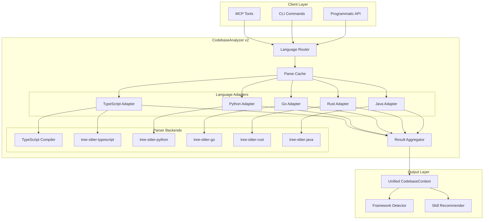
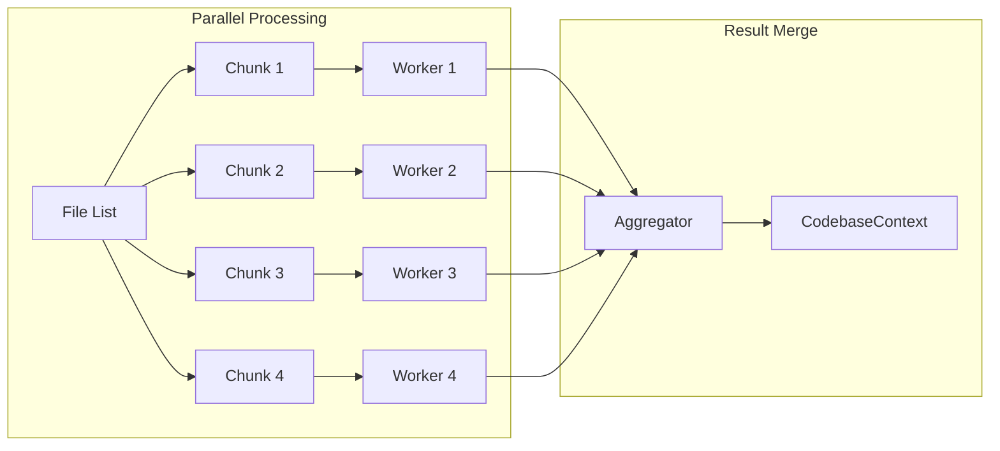
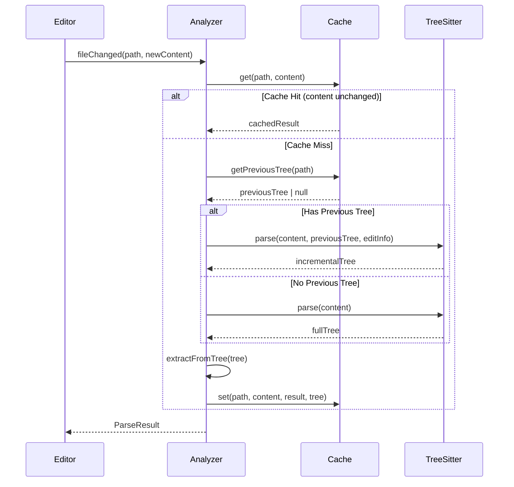

# Multi-Language Codebase Analysis Architecture

**Status**: Proposed
**Date**: 2026-01-09
**Author**: Architecture Team
**Linear Project**: [SMI-776: Multi-Language AST Analysis](https://linear.app/smith-horn-group/project/smi-776-multi-language-ast-analysis-ec42652be532)
**Related Issues**: SMI-776, SMI-600, SMI-602
**Supersedes**: ADR-010 (Option A deferred implementation)

## Linear Issues

| Issue | Title | Phase |
|-------|-------|-------|
| [SMI-1303](https://linear.app/smith-horn-group/issue/SMI-1303) | Foundation: Tree-sitter Core Infrastructure | 1 |
| [SMI-1304](https://linear.app/smith-horn-group/issue/SMI-1304) | Python Language Adapter | 2 |
| [SMI-1305](https://linear.app/smith-horn-group/issue/SMI-1305) | Go Language Adapter | 3 |
| [SMI-1306](https://linear.app/smith-horn-group/issue/SMI-1306) | Rust Language Adapter | 4 |
| [SMI-1307](https://linear.app/smith-horn-group/issue/SMI-1307) | Java Language Adapter | 5 |
| [SMI-1308](https://linear.app/smith-horn-group/issue/SMI-1308) | Performance Optimization | 6 |
| [SMI-1309](https://linear.app/smith-horn-group/issue/SMI-1309) | Incremental Parsing & Tree Caching | 7 |
| [SMI-1310](https://linear.app/smith-horn-group/issue/SMI-1310) | TypeScript Adapter (Backward Compatibility) | 1 |
| [SMI-1311](https://linear.app/smith-horn-group/issue/SMI-1311) | Documentation & v2.0.0 Release | 8 |

---

## Executive Summary

This document defines the architecture for expanding Skillsmith's `CodebaseAnalyzer` to support multi-language analysis using tree-sitter. The goal is to analyze codebases in 5+ languages (TypeScript, Python, Go, Rust, Java) while maintaining sub-5-second performance for projects with 10,000 files.

---

## 1. System Overview

### 1.1 Current State

The existing `CodebaseAnalyzer` (per ADR-010, Option B) uses the TypeScript compiler API exclusively:

```
┌─────────────────────────────────────────────────────────┐
│                   CodebaseAnalyzer                       │
├─────────────────────────────────────────────────────────┤
│  ┌─────────────┐  ┌─────────────┐  ┌─────────────────┐ │
│  │  parsers.ts │  │  types.ts   │  │ framework-      │ │
│  │  (tsc API)  │  │             │  │ detector.ts     │ │
│  └──────┬──────┘  └─────────────┘  └─────────────────┘ │
│         │                                               │
│         ▼                                               │
│  ┌─────────────────────────────────────────────────┐   │
│  │         TypeScript Compiler API                  │   │
│  │         (.ts, .tsx, .js, .jsx, .mjs)            │   │
│  └─────────────────────────────────────────────────┘   │
└─────────────────────────────────────────────────────────┘
```

### 1.2 Target State



---

## 2. Component Architecture

### 2.1 Core Components

| Component | Responsibility | Location |
|-----------|---------------|----------|
| `LanguageRouter` | Detect language, dispatch to adapter | `analysis/router.ts` |
| `ParseCache` | Cache parsed ASTs with invalidation | `analysis/cache.ts` |
| `LanguageAdapter` | Abstract interface for language parsing | `analysis/adapters/base.ts` |
| `ResultAggregator` | Merge results into unified format | `analysis/aggregator.ts` |
| `TreeSitterManager` | Manage tree-sitter parser lifecycle | `analysis/tree-sitter/manager.ts` |

### 2.2 Component Diagram

```
packages/core/src/analysis/
├── CodebaseAnalyzer.ts          # Main entry point (updated)
├── types.ts                     # Extended with multi-language types
├── router.ts                    # NEW: Language detection & routing
├── cache.ts                     # NEW: Parse result caching
├── aggregator.ts                # NEW: Result aggregation
├── adapters/
│   ├── base.ts                  # NEW: Abstract LanguageAdapter
│   ├── typescript.ts            # NEW: Wraps existing parsers.ts
│   ├── python.ts                # NEW: Python adapter
│   ├── go.ts                    # NEW: Go adapter
│   ├── rust.ts                  # NEW: Rust adapter
│   └── java.ts                  # NEW: Java adapter
├── tree-sitter/
│   ├── manager.ts               # NEW: Parser instance management
│   ├── queries/                 # NEW: Language-specific queries
│   │   ├── typescript.scm
│   │   ├── python.scm
│   │   ├── go.scm
│   │   ├── rust.scm
│   │   └── java.scm
│   └── bindings.ts              # NEW: Native module loading
├── parsers.ts                   # EXISTING: TypeScript-specific
├── framework-detector.ts        # UPDATED: Multi-language rules
└── index.ts                     # UPDATED: Export new components
```

---

## 3. Language Adapter Pattern

### 3.1 Abstract Adapter Interface

```typescript
// analysis/adapters/base.ts

import type { ImportInfo, ExportInfo, FunctionInfo, ParseResult } from '../types.js'

/**
 * Language detection result
 */
export interface LanguageInfo {
  /** Language identifier */
  language: SupportedLanguage
  /** File extensions for this language */
  extensions: string[]
  /** Confidence level (0-1) */
  confidence: number
}

/**
 * Supported languages for analysis
 */
export type SupportedLanguage =
  | 'typescript'
  | 'javascript'
  | 'python'
  | 'go'
  | 'rust'
  | 'java'

/**
 * Abstract base class for language-specific adapters
 *
 * Each adapter translates language-specific AST nodes into
 * the unified ParseResult format.
 */
export abstract class LanguageAdapter {
  /** Language this adapter handles */
  abstract readonly language: SupportedLanguage

  /** File extensions this adapter handles */
  abstract readonly extensions: string[]

  /**
   * Check if this adapter can handle a file
   */
  canHandle(filePath: string): boolean {
    const ext = path.extname(filePath).toLowerCase()
    return this.extensions.includes(ext)
  }

  /**
   * Parse a single file and extract information
   *
   * @param content - File content to parse
   * @param filePath - Relative path for tracking
   * @returns Parsed imports, exports, and functions
   */
  abstract parseFile(content: string, filePath: string): ParseResult

  /**
   * Parse file incrementally (for editor integration)
   *
   * @param content - Updated content
   * @param filePath - File path
   * @param previousTree - Previous parse tree for incremental update
   * @returns Updated parse result
   */
  abstract parseIncremental(
    content: string,
    filePath: string,
    previousTree?: unknown
  ): ParseResult

  /**
   * Get language-specific framework detection rules
   */
  abstract getFrameworkRules(): FrameworkRule[]

  /**
   * Clean up any resources (parser instances, etc.)
   */
  abstract dispose(): void
}
```

### 3.2 TypeScript Adapter (Wrapping Existing Implementation)

```typescript
// analysis/adapters/typescript.ts

import type { SupportedLanguage } from './base.js'
import { LanguageAdapter } from './base.js'
import { parseFile as tsParseFile } from '../parsers.js'
import { FRAMEWORK_RULES } from '../framework-detector.js'
import type { ParseResult, FrameworkRule } from '../types.js'

/**
 * TypeScript/JavaScript adapter
 *
 * Uses the existing TypeScript compiler API for maximum accuracy.
 * Falls back to tree-sitter for incremental parsing.
 */
export class TypeScriptAdapter extends LanguageAdapter {
  readonly language: SupportedLanguage = 'typescript'
  readonly extensions = ['.ts', '.tsx', '.js', '.jsx', '.mjs', '.cjs']

  private treeSitterParser: Parser | null = null

  parseFile(content: string, filePath: string): ParseResult {
    // Use existing TypeScript compiler API parser
    return tsParseFile(content, filePath)
  }

  parseIncremental(
    content: string,
    filePath: string,
    previousTree?: Tree
  ): ParseResult {
    // For incremental, use tree-sitter (faster for small changes)
    if (!this.treeSitterParser) {
      this.treeSitterParser = this.initTreeSitter()
    }

    const tree = previousTree
      ? this.treeSitterParser.parse(content, previousTree)
      : this.treeSitterParser.parse(content)

    return this.extractFromTree(tree, filePath)
  }

  getFrameworkRules(): FrameworkRule[] {
    return FRAMEWORK_RULES
  }

  dispose(): void {
    this.treeSitterParser?.delete()
    this.treeSitterParser = null
  }

  private initTreeSitter(): Parser {
    const Parser = require('tree-sitter')
    const TypeScript = require('tree-sitter-typescript').typescript
    const parser = new Parser()
    parser.setLanguage(TypeScript)
    return parser
  }

  private extractFromTree(tree: Tree, filePath: string): ParseResult {
    // Tree-sitter query-based extraction
    // Implementation details in section 3.4
  }
}
```

### 3.3 Python Adapter

```typescript
// analysis/adapters/python.ts

import { LanguageAdapter, type SupportedLanguage } from './base.js'
import type { ParseResult, FrameworkRule, ImportInfo, ExportInfo, FunctionInfo } from '../types.js'

/**
 * Python adapter using tree-sitter-python
 */
export class PythonAdapter extends LanguageAdapter {
  readonly language: SupportedLanguage = 'python'
  readonly extensions = ['.py', '.pyi', '.pyw']

  private parser: Parser | null = null
  private importQuery: Query | null = null
  private functionQuery: Query | null = null

  parseFile(content: string, filePath: string): ParseResult {
    const tree = this.getParser().parse(content)
    return this.extractFromTree(tree, filePath)
  }

  parseIncremental(
    content: string,
    filePath: string,
    previousTree?: Tree
  ): ParseResult {
    const tree = previousTree
      ? this.getParser().parse(content, previousTree)
      : this.getParser().parse(content)
    return this.extractFromTree(tree, filePath)
  }

  getFrameworkRules(): FrameworkRule[] {
    return [
      {
        name: 'Django',
        depIndicators: ['django'],
        importIndicators: ['django', 'django.db', 'django.http'],
      },
      {
        name: 'FastAPI',
        depIndicators: ['fastapi'],
        importIndicators: ['fastapi', 'starlette'],
      },
      {
        name: 'Flask',
        depIndicators: ['flask'],
        importIndicators: ['flask'],
      },
      {
        name: 'pytest',
        depIndicators: ['pytest'],
        importIndicators: ['pytest'],
      },
      {
        name: 'pandas',
        depIndicators: ['pandas'],
        importIndicators: ['pandas', 'pd'],
      },
      {
        name: 'numpy',
        depIndicators: ['numpy'],
        importIndicators: ['numpy', 'np'],
      },
    ]
  }

  dispose(): void {
    this.parser?.delete()
    this.parser = null
  }

  private getParser(): Parser {
    if (!this.parser) {
      const Parser = require('tree-sitter')
      const Python = require('tree-sitter-python')
      this.parser = new Parser()
      this.parser.setLanguage(Python)
      this.initQueries()
    }
    return this.parser
  }

  private initQueries(): void {
    // Tree-sitter queries for Python (see section 3.4)
  }

  private extractFromTree(tree: Tree, filePath: string): ParseResult {
    const imports = this.extractImports(tree, filePath)
    const exports = this.extractExports(tree, filePath)
    const functions = this.extractFunctions(tree, filePath)
    return { imports, exports, functions }
  }

  private extractImports(tree: Tree, filePath: string): ImportInfo[] {
    const imports: ImportInfo[] = []

    // Query: import statements
    const importQuery = `
      (import_statement
        name: (dotted_name) @module)
      (import_from_statement
        module_name: (dotted_name) @module
        name: (dotted_name) @name)
    `

    // Execute query and map to ImportInfo
    const matches = this.importQuery!.matches(tree.rootNode)
    for (const match of matches) {
      // Map tree-sitter captures to ImportInfo
      imports.push({
        module: match.captures[0].node.text,
        namedImports: [],
        isTypeOnly: false,
        sourceFile: filePath,
      })
    }

    return imports
  }

  private extractExports(tree: Tree, filePath: string): ExportInfo[] {
    // Python uses __all__ for explicit exports
    // Otherwise, all top-level definitions are considered exports
    const exports: ExportInfo[] = []

    // Find __all__ definition
    // Find top-level function/class definitions

    return exports
  }

  private extractFunctions(tree: Tree, filePath: string): FunctionInfo[] {
    const functions: FunctionInfo[] = []

    const functionQuery = `
      (function_definition
        name: (identifier) @name
        parameters: (parameters) @params)
      (async_function_definition
        name: (identifier) @name
        parameters: (parameters) @params)
    `

    // Execute query and map to FunctionInfo

    return functions
  }
}
```

### 3.4 Tree-Sitter Query Files

```scheme
; analysis/tree-sitter/queries/python.scm

; Import statements
(import_statement
  name: (dotted_name) @import.module)

(import_from_statement
  module_name: (dotted_name) @import.module
  name: [(dotted_name) (aliased_import)]* @import.name)

; Function definitions
(function_definition
  name: (identifier) @function.name
  parameters: (parameters) @function.params
  return_type: (type)? @function.return_type) @function.def

(async_function_definition
  name: (identifier) @function.name
  parameters: (parameters) @function.params) @function.async

; Class definitions
(class_definition
  name: (identifier) @class.name
  superclasses: (argument_list)? @class.bases) @class.def

; Exports (__all__)
(assignment
  left: (identifier) @export.all
  right: (list) @export.names
  (#eq? @export.all "__all__"))
```

```scheme
; analysis/tree-sitter/queries/go.scm

; Import statements
(import_declaration
  (import_spec
    path: (interpreted_string_literal) @import.path
    name: (package_identifier)? @import.alias))

; Function definitions
(function_declaration
  name: (identifier) @function.name
  parameters: (parameter_list) @function.params
  result: (_)? @function.return) @function.def

(method_declaration
  receiver: (parameter_list) @method.receiver
  name: (field_identifier) @function.name
  parameters: (parameter_list) @function.params) @method.def

; Type definitions (exports if capitalized)
(type_declaration
  (type_spec
    name: (type_identifier) @type.name
    type: (_) @type.def))

; Package declaration
(package_clause
  (package_identifier) @package.name)
```

---

## 4. Performance Requirements

### 4.1 Performance Targets

| Metric | Target | Measurement |
|--------|--------|-------------|
| 10k file project | < 5 seconds | Cold parse, no cache |
| Incremental parse | < 100ms | Single file change |
| Memory per file | < 50KB | Average AST size |
| Parser initialization | < 500ms | First parse startup |
| Cache hit ratio | > 80% | Typical development |

### 4.2 Performance Strategy



### 4.3 Optimization Techniques

**1. Worker Thread Pool**

```typescript
// analysis/worker-pool.ts

import { Worker } from 'worker_threads'
import os from 'os'

export class ParserWorkerPool {
  private workers: Worker[] = []
  private readonly poolSize: number
  private taskQueue: ParseTask[] = []
  private activeWorkers = 0

  constructor(poolSize = os.cpus().length - 1) {
    this.poolSize = Math.max(1, poolSize)
    this.initializePool()
  }

  async parseFiles(files: FileInfo[]): Promise<ParseResult[]> {
    const chunkSize = Math.ceil(files.length / this.poolSize)
    const chunks = this.chunkArray(files, chunkSize)

    const results = await Promise.all(
      chunks.map((chunk, i) => this.dispatchToWorker(i, chunk))
    )

    return results.flat()
  }

  private initializePool(): void {
    for (let i = 0; i < this.poolSize; i++) {
      const worker = new Worker('./parser-worker.js')
      this.workers.push(worker)
    }
  }

  dispose(): void {
    this.workers.forEach(w => w.terminate())
    this.workers = []
  }
}
```

**2. Lazy Parser Loading**

```typescript
// analysis/tree-sitter/manager.ts

/**
 * Manages tree-sitter parser instances with lazy loading
 *
 * Parsers are loaded on-demand and cached for reuse.
 * Native modules are loaded lazily per ADR-009 patterns.
 */
export class TreeSitterManager {
  private parsers: Map<SupportedLanguage, Parser> = new Map()
  private loading: Map<SupportedLanguage, Promise<Parser>> = new Map()

  /**
   * Get parser for language, loading if necessary
   */
  async getParser(language: SupportedLanguage): Promise<Parser> {
    // Return cached parser
    if (this.parsers.has(language)) {
      return this.parsers.get(language)!
    }

    // Return in-progress load
    if (this.loading.has(language)) {
      return this.loading.get(language)!
    }

    // Start new load
    const loadPromise = this.loadParser(language)
    this.loading.set(language, loadPromise)

    try {
      const parser = await loadPromise
      this.parsers.set(language, parser)
      return parser
    } finally {
      this.loading.delete(language)
    }
  }

  private async loadParser(language: SupportedLanguage): Promise<Parser> {
    // Dynamic import for native modules (per standards.md §4.11)
    const Parser = (await import('tree-sitter')).default
    const parser = new Parser()

    const languageModule = await this.loadLanguageModule(language)
    parser.setLanguage(languageModule)

    return parser
  }

  private async loadLanguageModule(language: SupportedLanguage): Promise<unknown> {
    switch (language) {
      case 'typescript':
      case 'javascript':
        return (await import('tree-sitter-typescript')).typescript
      case 'python':
        return (await import('tree-sitter-python')).default
      case 'go':
        return (await import('tree-sitter-go')).default
      case 'rust':
        return (await import('tree-sitter-rust')).default
      case 'java':
        return (await import('tree-sitter-java')).default
      default:
        throw new Error(`Unsupported language: ${language}`)
    }
  }

  dispose(): void {
    for (const parser of this.parsers.values()) {
      parser.delete()
    }
    this.parsers.clear()
  }
}
```

**3. File Content Streaming**

```typescript
// analysis/file-streamer.ts

import { createReadStream } from 'fs'
import { pipeline } from 'stream/promises'

/**
 * Stream large files to reduce memory pressure
 *
 * For files > 1MB, use streaming to avoid loading
 * entire content into memory.
 */
export async function* streamFiles(
  files: string[],
  maxBufferSize = 1024 * 1024
): AsyncGenerator<FileContent> {
  for (const filePath of files) {
    const stat = await fs.stat(filePath)

    if (stat.size > maxBufferSize) {
      // Stream large files
      yield* streamLargeFile(filePath)
    } else {
      // Read small files directly
      const content = await fs.readFile(filePath, 'utf-8')
      yield { path: filePath, content, size: stat.size }
    }
  }
}
```

---

## 5. Memory Management Strategy

### 5.1 Memory Budget

| Component | Budget | Strategy |
|-----------|--------|----------|
| Parser instances | 100MB | Pool & reuse |
| AST cache | 200MB | LRU eviction |
| Parse results | 50MB | Streaming aggregation |
| Worker threads | 4 x 50MB | Bounded pool |

### 5.2 Cache Implementation

```typescript
// analysis/cache.ts

import { LRUCache } from 'lru-cache'
import { createHash } from 'crypto'

interface CacheEntry {
  result: ParseResult
  contentHash: string
  timestamp: number
  size: number
}

/**
 * LRU cache for parse results with memory-based eviction
 */
export class ParseCache {
  private cache: LRUCache<string, CacheEntry>
  private readonly maxMemory: number

  constructor(options: { maxMemoryMB?: number } = {}) {
    this.maxMemory = (options.maxMemoryMB ?? 200) * 1024 * 1024

    this.cache = new LRUCache({
      maxSize: this.maxMemory,
      sizeCalculation: (entry) => entry.size,
      dispose: (entry, key) => {
        // Optional: Log eviction for debugging
      },
    })
  }

  /**
   * Get cached result if content unchanged
   */
  get(filePath: string, content: string): ParseResult | null {
    const entry = this.cache.get(filePath)
    if (!entry) return null

    const contentHash = this.hashContent(content)
    if (entry.contentHash !== contentHash) {
      // Content changed, invalidate
      this.cache.delete(filePath)
      return null
    }

    return entry.result
  }

  /**
   * Store parse result in cache
   */
  set(filePath: string, content: string, result: ParseResult): void {
    const contentHash = this.hashContent(content)
    const size = this.estimateSize(result)

    this.cache.set(filePath, {
      result,
      contentHash,
      timestamp: Date.now(),
      size,
    })
  }

  /**
   * Invalidate entries for changed files
   */
  invalidate(filePaths: string[]): void {
    for (const path of filePaths) {
      this.cache.delete(path)
    }
  }

  /**
   * Clear entire cache
   */
  clear(): void {
    this.cache.clear()
  }

  /**
   * Get cache statistics
   */
  getStats(): CacheStats {
    return {
      size: this.cache.calculatedSize,
      entries: this.cache.size,
      maxSize: this.maxMemory,
      hitRate: this.cache.hits / (this.cache.hits + this.cache.misses),
    }
  }

  private hashContent(content: string): string {
    return createHash('sha256').update(content).digest('hex').slice(0, 16)
  }

  private estimateSize(result: ParseResult): number {
    // Rough estimate: 100 bytes per import/export/function
    return (
      result.imports.length * 100 +
      result.exports.length * 100 +
      result.functions.length * 100 +
      1000 // Base overhead
    )
  }
}
```

### 5.3 Memory Pressure Handling

```typescript
// analysis/memory-monitor.ts

/**
 * Monitor memory usage and trigger cleanup when needed
 */
export class MemoryMonitor {
  private readonly threshold: number
  private readonly cache: ParseCache

  constructor(cache: ParseCache, thresholdMB = 500) {
    this.cache = cache
    this.threshold = thresholdMB * 1024 * 1024
  }

  /**
   * Check memory and cleanup if needed
   */
  checkAndCleanup(): void {
    const usage = process.memoryUsage()

    if (usage.heapUsed > this.threshold) {
      // Clear 50% of cache
      const stats = this.cache.getStats()
      console.warn(
        `Memory pressure: ${Math.round(usage.heapUsed / 1024 / 1024)}MB, ` +
        `clearing cache (${stats.entries} entries)`
      )
      this.cache.clear()

      // Force garbage collection if available
      if (global.gc) {
        global.gc()
      }
    }
  }

  /**
   * Start periodic monitoring
   */
  startMonitoring(intervalMs = 10000): () => void {
    const timer = setInterval(() => this.checkAndCleanup(), intervalMs)
    return () => clearInterval(timer)
  }
}
```

---

## 6. Incremental Parsing Support

### 6.1 Incremental Update Flow



### 6.2 Edit Tracking

```typescript
// analysis/incremental.ts

import type { Edit, Point } from 'tree-sitter'

/**
 * Track edits for incremental parsing
 */
export interface FileEdit {
  startIndex: number
  oldEndIndex: number
  newEndIndex: number
  startPosition: Point
  oldEndPosition: Point
  newEndPosition: Point
}

/**
 * Calculate edit from content diff
 */
export function calculateEdit(
  oldContent: string,
  newContent: string,
  changeStart: number,
  changeEnd: number,
  newText: string
): FileEdit {
  const startPosition = indexToPosition(oldContent, changeStart)
  const oldEndPosition = indexToPosition(oldContent, changeEnd)
  const newEndPosition = indexToPosition(
    newContent,
    changeStart + newText.length
  )

  return {
    startIndex: changeStart,
    oldEndIndex: changeEnd,
    newEndIndex: changeStart + newText.length,
    startPosition,
    oldEndPosition,
    newEndPosition,
  }
}

function indexToPosition(content: string, index: number): Point {
  let row = 0
  let column = 0

  for (let i = 0; i < index && i < content.length; i++) {
    if (content[i] === '\n') {
      row++
      column = 0
    } else {
      column++
    }
  }

  return { row, column }
}
```

### 6.3 Tree Cache

```typescript
// analysis/tree-cache.ts

/**
 * Cache parsed trees for incremental updates
 *
 * Separate from ParseCache to manage tree lifecycle
 */
export class TreeCache {
  private trees: Map<string, { tree: Tree; version: number }> = new Map()
  private readonly maxTrees = 100

  get(filePath: string): Tree | null {
    return this.trees.get(filePath)?.tree ?? null
  }

  set(filePath: string, tree: Tree, version: number): void {
    // Evict oldest if at capacity
    if (this.trees.size >= this.maxTrees) {
      const oldest = this.findOldest()
      if (oldest) {
        this.trees.get(oldest)?.tree.delete()
        this.trees.delete(oldest)
      }
    }

    // Delete old tree before setting new
    const existing = this.trees.get(filePath)
    if (existing) {
      existing.tree.delete()
    }

    this.trees.set(filePath, { tree, version })
  }

  invalidate(filePath: string): void {
    const entry = this.trees.get(filePath)
    if (entry) {
      entry.tree.delete()
      this.trees.delete(filePath)
    }
  }

  dispose(): void {
    for (const entry of this.trees.values()) {
      entry.tree.delete()
    }
    this.trees.clear()
  }

  private findOldest(): string | null {
    let oldest: string | null = null
    let oldestVersion = Infinity

    for (const [path, entry] of this.trees) {
      if (entry.version < oldestVersion) {
        oldestVersion = entry.version
        oldest = path
      }
    }

    return oldest
  }
}
```

---

## 7. Language-Agnostic Output Format

### 7.1 Extended Type Definitions

```typescript
// analysis/types.ts (extended)

/**
 * Language identifier for parsed content
 */
export type SupportedLanguage =
  | 'typescript'
  | 'javascript'
  | 'python'
  | 'go'
  | 'rust'
  | 'java'

/**
 * Extended import info with language context
 */
export interface ImportInfo {
  /** Module specifier */
  module: string
  /** Named imports */
  namedImports: string[]
  /** Default import name */
  defaultImport?: string
  /** Namespace import */
  namespaceImport?: string
  /** Type-only import (TS specific) */
  isTypeOnly: boolean
  /** Source file */
  sourceFile: string
  /** Source language */
  language: SupportedLanguage
  /** Line number */
  line?: number
}

/**
 * Extended export info
 */
export interface ExportInfo {
  /** Exported name */
  name: string
  /** Export kind */
  kind: ExportKind
  /** Default export */
  isDefault: boolean
  /** Source file */
  sourceFile: string
  /** Source language */
  language: SupportedLanguage
  /** Visibility (for Go, Rust, Java) */
  visibility?: 'public' | 'private' | 'protected' | 'internal'
  /** Line number */
  line?: number
}

export type ExportKind =
  | 'function'
  | 'class'
  | 'variable'
  | 'type'
  | 'interface'
  | 'enum'
  | 'struct'     // Go, Rust
  | 'trait'      // Rust
  | 'module'     // Python, Rust
  | 'unknown'

/**
 * Extended function info
 */
export interface FunctionInfo {
  /** Function name */
  name: string
  /** Parameter count */
  parameterCount: number
  /** Async function */
  isAsync: boolean
  /** Exported/public */
  isExported: boolean
  /** Source file */
  sourceFile: string
  /** Line number */
  line: number
  /** Source language */
  language: SupportedLanguage
  /** Method receiver (Go) */
  receiver?: string
  /** Decorators (Python) */
  decorators?: string[]
  /** Attributes (Rust) */
  attributes?: string[]
}

/**
 * Language-specific dependency info
 */
export interface DependencyInfo {
  /** Package name */
  name: string
  /** Version specifier */
  version: string
  /** Dev dependency */
  isDev: boolean
  /** Package manager source */
  source: 'npm' | 'pip' | 'go' | 'cargo' | 'maven' | 'gradle'
}

/**
 * Extended codebase context
 */
export interface CodebaseContext {
  /** Root path */
  rootPath: string
  /** All imports */
  imports: ImportInfo[]
  /** All exports */
  exports: ExportInfo[]
  /** All functions */
  functions: FunctionInfo[]
  /** Detected frameworks */
  frameworks: FrameworkInfo[]
  /** Dependencies by package manager */
  dependencies: DependencyInfo[]
  /** File statistics */
  stats: {
    totalFiles: number
    filesByExtension: Record<string, number>
    filesByLanguage: Record<SupportedLanguage, number>
    totalLines: number
  }
  /** Analysis metadata */
  metadata: {
    durationMs: number
    version: string
    languages: SupportedLanguage[]
    cacheHitRate: number
  }
}
```

### 7.2 Result Aggregator

```typescript
// analysis/aggregator.ts

import type {
  ParseResult,
  CodebaseContext,
  SupportedLanguage,
  ImportInfo,
  ExportInfo,
  FunctionInfo
} from './types.js'

interface AggregatorInput {
  filePath: string
  language: SupportedLanguage
  result: ParseResult
}

/**
 * Aggregates parse results from multiple languages into unified context
 */
export class ResultAggregator {
  private imports: ImportInfo[] = []
  private exports: ExportInfo[] = []
  private functions: FunctionInfo[] = []
  private filesByExtension: Record<string, number> = {}
  private filesByLanguage: Record<SupportedLanguage, number> = {} as Record<SupportedLanguage, number>
  private totalLines = 0
  private languages = new Set<SupportedLanguage>()

  /**
   * Add parse result to aggregation
   */
  add(input: AggregatorInput): void {
    const { filePath, language, result } = input

    // Track language
    this.languages.add(language)
    this.filesByLanguage[language] = (this.filesByLanguage[language] ?? 0) + 1

    // Track extension
    const ext = path.extname(filePath)
    this.filesByExtension[ext] = (this.filesByExtension[ext] ?? 0) + 1

    // Add imports with language annotation
    for (const imp of result.imports) {
      this.imports.push({ ...imp, language })
    }

    // Add exports with language annotation
    for (const exp of result.exports) {
      this.exports.push({ ...exp, language })
    }

    // Add functions with language annotation
    for (const func of result.functions) {
      this.functions.push({ ...func, language })
    }
  }

  /**
   * Add line count for a file
   */
  addLines(count: number): void {
    this.totalLines += count
  }

  /**
   * Build final context
   */
  build(
    rootPath: string,
    dependencies: DependencyInfo[],
    frameworks: FrameworkInfo[],
    metadata: { durationMs: number; version: string; cacheHitRate: number }
  ): CodebaseContext {
    return {
      rootPath,
      imports: this.imports,
      exports: this.exports,
      functions: this.functions,
      frameworks,
      dependencies,
      stats: {
        totalFiles: Object.values(this.filesByExtension).reduce((a, b) => a + b, 0),
        filesByExtension: this.filesByExtension,
        filesByLanguage: this.filesByLanguage,
        totalLines: this.totalLines,
      },
      metadata: {
        ...metadata,
        languages: Array.from(this.languages),
      },
    }
  }

  /**
   * Reset aggregator for new analysis
   */
  reset(): void {
    this.imports = []
    this.exports = []
    this.functions = []
    this.filesByExtension = {}
    this.filesByLanguage = {} as Record<SupportedLanguage, number>
    this.totalLines = 0
    this.languages.clear()
  }
}
```

---

## 8. Integration with Existing CodebaseAnalyzer

### 8.1 Updated CodebaseAnalyzer

```typescript
// analysis/CodebaseAnalyzer.ts (updated)

import { LanguageRouter } from './router.js'
import { ParseCache } from './cache.js'
import { ResultAggregator } from './aggregator.js'
import { TreeSitterManager } from './tree-sitter/manager.js'
import { detectFrameworks } from './framework-detector.js'
import type {
  CodebaseContext,
  AnalyzeOptions,
  SupportedLanguage
} from './types.js'

/**
 * CodebaseAnalyzer v2 - Multi-language support
 *
 * Backwards compatible with v1 API while adding multi-language capabilities.
 *
 * @example
 * const analyzer = new CodebaseAnalyzer();
 * const context = await analyzer.analyze('/path/to/project');
 * console.log(context.metadata.languages); // ['typescript', 'python']
 */
export class CodebaseAnalyzer {
  private readonly version = '2.0.0'
  private readonly router: LanguageRouter
  private readonly cache: ParseCache
  private readonly treeSitterManager: TreeSitterManager
  private readonly aggregator: ResultAggregator

  constructor(options: AnalyzerOptions = {}) {
    this.cache = new ParseCache({ maxMemoryMB: options.cacheSizeMB })
    this.treeSitterManager = new TreeSitterManager()
    this.router = new LanguageRouter(this.treeSitterManager)
    this.aggregator = new ResultAggregator()
  }

  /**
   * Analyze a codebase and extract context for skill recommendations
   *
   * @param rootPath - Root directory of the codebase
   * @param options - Analysis options
   * @returns CodebaseContext with extracted information
   */
  async analyze(
    rootPath: string,
    options: AnalyzeOptions = {}
  ): Promise<CodebaseContext> {
    const startTime = performance.now()

    const {
      maxFiles = 10000,
      excludeDirs = DEFAULT_EXCLUDE_DIRS,
      includeDevDeps = true,
      languages,  // Optional: limit to specific languages
      useCache = true,
    } = options

    // Reset aggregator
    this.aggregator.reset()

    // Resolve path
    const absolutePath = path.resolve(rootPath)
    if (!fs.existsSync(absolutePath)) {
      throw new Error(`Directory not found: ${absolutePath}`)
    }

    // Find all source files
    const sourceFiles = await this.findSourceFiles(
      absolutePath,
      excludeDirs,
      maxFiles,
      languages
    )

    // Parse files in parallel
    let cacheHits = 0
    let cacheMisses = 0

    await this.parseFilesParallel(sourceFiles, absolutePath, useCache, {
      onCacheHit: () => cacheHits++,
      onCacheMiss: () => cacheMisses++,
    })

    // Read dependencies from all package managers
    const dependencies = await this.readAllDependencies(absolutePath, includeDevDeps)

    // Detect frameworks using all adapters' rules
    const allImports = this.aggregator.getImports()
    const frameworks = detectFrameworks(allImports, dependencies, this.router.getAllFrameworkRules())

    const endTime = performance.now()

    return this.aggregator.build(absolutePath, dependencies, frameworks, {
      durationMs: Math.round(endTime - startTime),
      version: this.version,
      cacheHitRate: cacheHits / (cacheHits + cacheMisses) || 0,
    })
  }

  /**
   * Parse a single file (for incremental updates)
   */
  async parseFile(
    filePath: string,
    content: string,
    previousTree?: unknown
  ): Promise<ParseResult> {
    const adapter = this.router.getAdapter(filePath)

    if (previousTree) {
      return adapter.parseIncremental(content, filePath, previousTree)
    }

    return adapter.parseFile(content, filePath)
  }

  /**
   * Get supported languages
   */
  getSupportedLanguages(): SupportedLanguage[] {
    return this.router.getSupportedLanguages()
  }

  /**
   * Check if a language is supported
   */
  supportsLanguage(filePath: string): boolean {
    return this.router.canHandle(filePath)
  }

  /**
   * Clean up resources
   */
  dispose(): void {
    this.router.dispose()
    this.treeSitterManager.dispose()
    this.cache.clear()
  }

  // ... rest of implementation
}
```

### 8.2 Backwards Compatibility

```typescript
// analysis/index.ts (updated)

// Re-export everything from v1 for backwards compatibility
export * from './types.js'
export * from './parsers.js'
export * from './framework-detector.js'
export { CodebaseAnalyzer } from './CodebaseAnalyzer.js'

// New v2 exports
export { LanguageRouter } from './router.js'
export { ParseCache } from './cache.js'
export { ResultAggregator } from './aggregator.js'
export { TreeSitterManager } from './tree-sitter/manager.js'
export { LanguageAdapter } from './adapters/base.js'
export { TypeScriptAdapter } from './adapters/typescript.js'
export { PythonAdapter } from './adapters/python.js'
export { GoAdapter } from './adapters/go.js'
export { RustAdapter } from './adapters/rust.js'
export { JavaAdapter } from './adapters/java.js'

// Type exports
export type { SupportedLanguage } from './types.js'
```

---

## 9. Testing Strategy

### 9.1 Test Categories

| Category | Coverage Target | Location |
|----------|-----------------|----------|
| Unit: Adapters | 90% | `adapters/*.test.ts` |
| Unit: Cache | 90% | `cache.test.ts` |
| Unit: Aggregator | 90% | `aggregator.test.ts` |
| Integration: Multi-lang | 80% | `integration/*.test.ts` |
| Performance | Benchmarks | `benchmarks/*.bench.ts` |
| E2E: Real codebases | Smoke tests | `e2e/*.test.ts` |

### 9.2 Test Fixtures

```
packages/core/tests/fixtures/
├── typescript/
│   ├── simple.ts
│   ├── react-component.tsx
│   └── complex-imports.ts
├── python/
│   ├── simple.py
│   ├── django-view.py
│   └── fastapi-route.py
├── go/
│   ├── simple.go
│   ├── http-handler.go
│   └── grpc-service.go
├── rust/
│   ├── simple.rs
│   ├── actix-handler.rs
│   └── traits.rs
├── java/
│   ├── Simple.java
│   ├── SpringController.java
│   └── Interface.java
└── polyglot/
    ├── package.json
    ├── pyproject.toml
    ├── go.mod
    ├── Cargo.toml
    ├── pom.xml
    └── src/
        ├── index.ts
        ├── main.py
        ├── main.go
        ├── lib.rs
        └── Main.java
```

### 9.3 Unit Test Example

```typescript
// adapters/python.test.ts

import { describe, it, expect, beforeEach, afterEach } from 'vitest'
import { PythonAdapter } from './python.js'

describe('PythonAdapter', () => {
  let adapter: PythonAdapter

  beforeEach(() => {
    adapter = new PythonAdapter()
  })

  afterEach(() => {
    adapter.dispose()
  })

  describe('canHandle', () => {
    it('handles .py files', () => {
      expect(adapter.canHandle('main.py')).toBe(true)
      expect(adapter.canHandle('types.pyi')).toBe(true)
    })

    it('does not handle other files', () => {
      expect(adapter.canHandle('main.ts')).toBe(false)
      expect(adapter.canHandle('main.go')).toBe(false)
    })
  })

  describe('parseFile', () => {
    it('extracts import statements', () => {
      const content = `
import os
from typing import List, Optional
from django.http import HttpResponse
      `

      const result = adapter.parseFile(content, 'test.py')

      expect(result.imports).toHaveLength(3)
      expect(result.imports[0]).toMatchObject({
        module: 'os',
        namedImports: [],
      })
      expect(result.imports[1]).toMatchObject({
        module: 'typing',
        namedImports: ['List', 'Optional'],
      })
    })

    it('extracts function definitions', () => {
      const content = `
def sync_function(a, b, c):
    pass

async def async_function(x):
    pass
      `

      const result = adapter.parseFile(content, 'test.py')

      expect(result.functions).toHaveLength(2)
      expect(result.functions[0]).toMatchObject({
        name: 'sync_function',
        parameterCount: 3,
        isAsync: false,
      })
      expect(result.functions[1]).toMatchObject({
        name: 'async_function',
        parameterCount: 1,
        isAsync: true,
      })
    })

    it('detects __all__ exports', () => {
      const content = `
__all__ = ['public_func', 'PublicClass']

def public_func():
    pass

def _private_func():
    pass

class PublicClass:
    pass
      `

      const result = adapter.parseFile(content, 'test.py')

      expect(result.exports).toContainEqual(
        expect.objectContaining({ name: 'public_func' })
      )
      expect(result.exports).toContainEqual(
        expect.objectContaining({ name: 'PublicClass' })
      )
      expect(result.exports).not.toContainEqual(
        expect.objectContaining({ name: '_private_func' })
      )
    })
  })

  describe('getFrameworkRules', () => {
    it('includes Django detection', () => {
      const rules = adapter.getFrameworkRules()
      const django = rules.find(r => r.name === 'Django')

      expect(django).toBeDefined()
      expect(django?.importIndicators).toContain('django')
    })
  })
})
```

### 9.4 Performance Benchmark

```typescript
// benchmarks/multi-language.bench.ts

import { bench, describe } from 'vitest'
import { CodebaseAnalyzer } from '../CodebaseAnalyzer.js'
import path from 'path'

describe('CodebaseAnalyzer Performance', () => {
  const analyzer = new CodebaseAnalyzer()

  bench('parse 1000 TypeScript files', async () => {
    await analyzer.analyze(
      path.join(__dirname, 'fixtures/large-ts-project'),
      { maxFiles: 1000 }
    )
  })

  bench('parse 1000 Python files', async () => {
    await analyzer.analyze(
      path.join(__dirname, 'fixtures/large-python-project'),
      { maxFiles: 1000 }
    )
  })

  bench('parse 10000 mixed files (target: <5s)', async () => {
    const start = performance.now()

    await analyzer.analyze(
      path.join(__dirname, 'fixtures/large-polyglot-project'),
      { maxFiles: 10000 }
    )

    const duration = performance.now() - start
    expect(duration).toBeLessThan(5000)
  }, { timeout: 10000 })

  bench('incremental parse (target: <100ms)', async () => {
    const content = 'def new_function(): pass'
    const start = performance.now()

    await analyzer.parseFile('test.py', content)

    const duration = performance.now() - start
    expect(duration).toBeLessThan(100)
  })
})
```

---

## 10. Rollout Phases

### Phase 1: Foundation (2 weeks)

**Deliverables:**
- [ ] `LanguageAdapter` base class
- [ ] `TypeScriptAdapter` wrapping existing `parsers.ts`
- [ ] `LanguageRouter` with detection
- [ ] `ParseCache` with LRU eviction
- [ ] `ResultAggregator` for unified output
- [ ] Extended type definitions

**Exit Criteria:**
- Existing TypeScript analysis unchanged
- New architecture in place but not active by default
- Unit tests for all new components

### Phase 2: Python Support (2 weeks)

**Deliverables:**
- [ ] `tree-sitter-python` integration
- [ ] `PythonAdapter` implementation
- [ ] Python framework detection rules (Django, FastAPI, Flask)
- [ ] `pyproject.toml` / `requirements.txt` dependency reading
- [ ] Integration tests with Python fixtures

**Exit Criteria:**
- Python codebases analyzed correctly
- Framework detection working
- Performance within targets

### Phase 3: Go Support (1 week)

**Deliverables:**
- [ ] `tree-sitter-go` integration
- [ ] `GoAdapter` implementation
- [ ] Go framework detection (Gin, Echo, Fiber)
- [ ] `go.mod` dependency reading

**Exit Criteria:**
- Go codebases analyzed correctly
- Exported vs unexported detection working

### Phase 4: Rust Support (1 week)

**Deliverables:**
- [ ] `tree-sitter-rust` integration
- [ ] `RustAdapter` implementation
- [ ] Rust framework detection (Actix, Axum, Rocket)
- [ ] `Cargo.toml` dependency reading

**Exit Criteria:**
- Rust codebases analyzed correctly
- Trait and struct extraction working

### Phase 5: Java Support (1 week)

**Deliverables:**
- [ ] `tree-sitter-java` integration
- [ ] `JavaAdapter` implementation
- [ ] Java framework detection (Spring, Quarkus)
- [ ] Maven/Gradle dependency reading

**Exit Criteria:**
- Java codebases analyzed correctly
- Annotation detection working

### Phase 6: Performance Optimization (1 week)

**Deliverables:**
- [ ] Worker thread pool implementation
- [ ] Parallel file parsing
- [ ] Memory pressure handling
- [ ] Performance benchmarks

**Exit Criteria:**
- 10k files in < 5 seconds
- Memory usage within budget
- Cache hit rate > 80%

### Phase 7: Incremental Parsing (1 week)

**Deliverables:**
- [ ] Tree cache implementation
- [ ] Edit tracking
- [ ] Incremental update API
- [ ] Editor integration documentation

**Exit Criteria:**
- Single file updates < 100ms
- Tree reuse working correctly

### Phase 8: Documentation & Release (1 week)

**Deliverables:**
- [ ] API documentation
- [ ] Migration guide from v1
- [ ] ADR update (ADR-010 addendum)
- [ ] Release notes

**Exit Criteria:**
- Documentation complete
- Breaking changes documented
- Version 2.0.0 released

---

## 11. Dependencies

### 11.1 New Dependencies

```json
{
  "dependencies": {
    "tree-sitter": "^0.21.0",
    "tree-sitter-typescript": "^0.21.0",
    "tree-sitter-python": "^0.21.0",
    "tree-sitter-go": "^0.21.0",
    "tree-sitter-rust": "^0.21.0",
    "tree-sitter-java": "^0.21.0",
    "lru-cache": "^10.0.0"
  },
  "devDependencies": {
    "@types/tree-sitter": "^0.21.0"
  }
}
```

### 11.2 Native Module Considerations

Tree-sitter uses native modules. Per ADR-002 and standards.md:

1. **Docker Required**: All development/testing in Docker container
2. **Lazy Loading**: Load tree-sitter modules dynamically (per standards.md section 4.11)
3. **Fallback Mode**: Provide TypeScript-only mode if tree-sitter unavailable
4. **CI Configuration**: Ensure CI builds native modules correctly

```typescript
// analysis/tree-sitter/bindings.ts

/**
 * Check if tree-sitter is available
 */
export async function isTreeSitterAvailable(): Promise<boolean> {
  try {
    await import('tree-sitter')
    return true
  } catch {
    return false
  }
}

/**
 * Get analyzer mode based on available dependencies
 */
export async function getAnalyzerMode(): Promise<'full' | 'typescript-only'> {
  if (await isTreeSitterAvailable()) {
    return 'full'
  }
  console.warn('tree-sitter not available, falling back to TypeScript-only mode')
  return 'typescript-only'
}
```

---

## 12. Risks and Mitigations

| Risk | Impact | Mitigation |
|------|--------|------------|
| tree-sitter native module issues | High | Lazy loading, fallback mode, Docker-first |
| Performance regression | Medium | Benchmarks in CI, caching strategy |
| Memory exhaustion on large projects | Medium | LRU cache, memory monitoring, streaming |
| Incomplete language coverage | Low | Query-based extraction, community contributions |
| Breaking API changes | Medium | Maintain v1 compatibility, migration guide |

---

## 13. Success Metrics

| Metric | Target | Measurement |
|--------|--------|-------------|
| Language coverage | 5 languages | Unit test suites |
| Performance | < 5s / 10k files | CI benchmarks |
| Memory | < 500MB peak | Memory profiling |
| Cache efficiency | > 80% hit rate | Runtime metrics |
| API compatibility | 100% v1 tests pass | Regression suite |
| Framework detection | 90% accuracy | Manual validation |

---

## References

- [ADR-010: Codebase Analysis Scope](../adr/010-codebase-analysis-scope.md)
- [Engineering Standards](./standards.md)
- [tree-sitter Documentation](https://tree-sitter.github.io/tree-sitter/)
- [SMI-776: Multi-Language AST Analysis](https://linear.app/smith-horn-group/issue/SMI-776)
