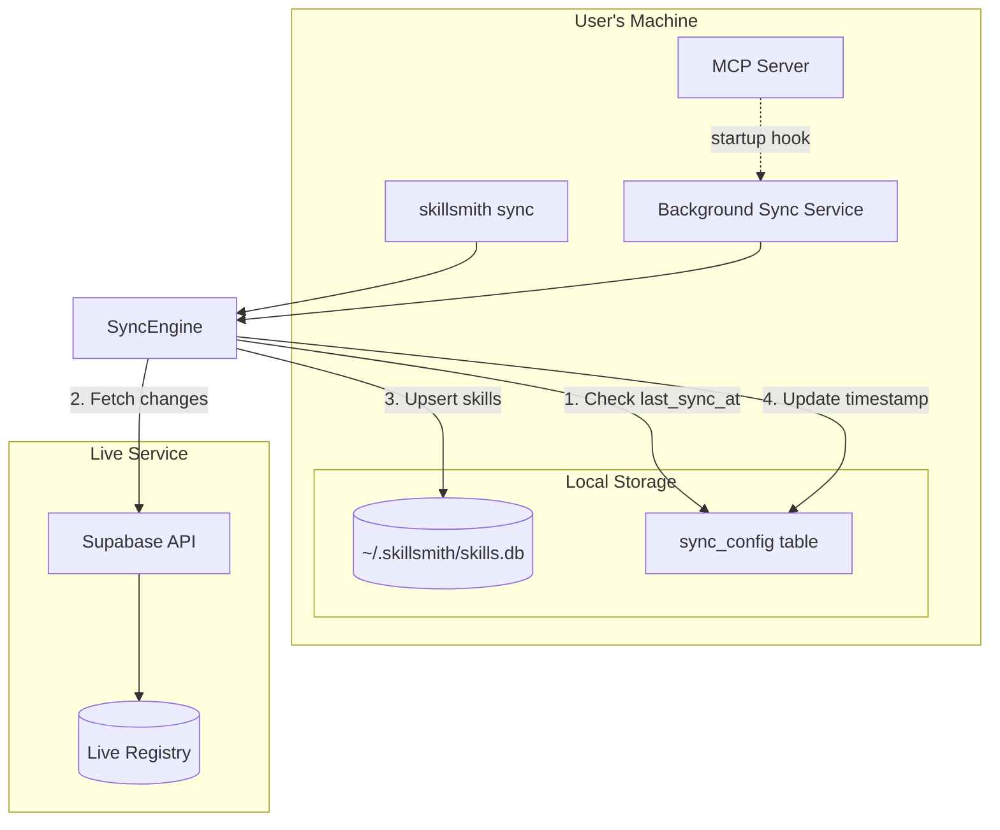
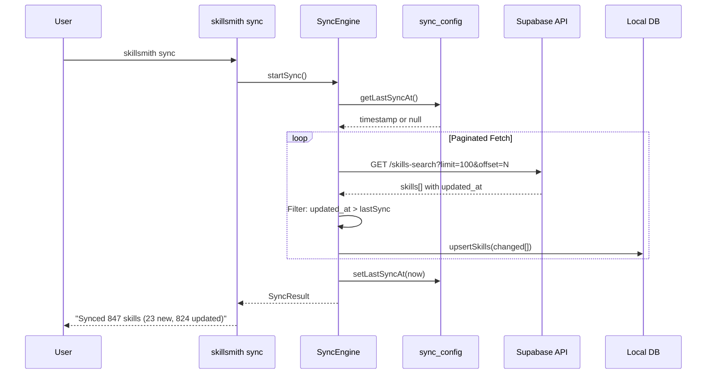

# Registry Sync Architecture

## Overview

The Registry Sync system keeps users' local skill databases up-to-date with the live Skillsmith registry. This addresses the challenge where users who install Skillsmith at different times would have different skill databases without a synchronization mechanism.

## Design Principles

1. **Offline-First**: Local database is always available, sync is additive
2. **Differential Sync**: Only fetch changes since last sync using timestamps
3. **Session-Based**: Background sync runs during active MCP server sessions
4. **User-Controlled**: Configurable frequency (daily/weekly) with manual override

## Architecture

### System Overview



### Sync Flow



## Data Model

### sync_config Table

Singleton configuration record for sync settings.

| Column | Type | Description |
|--------|------|-------------|
| id | TEXT | Always 'default' |
| enabled | INTEGER | Auto-sync enabled (1/0) |
| frequency | TEXT | 'daily' or 'weekly' |
| interval_ms | INTEGER | Milliseconds between syncs |
| last_sync_at | TEXT | ISO timestamp of last successful sync |
| next_sync_at | TEXT | Calculated next sync time |
| last_sync_count | INTEGER | Skills synced in last run |
| last_sync_error | TEXT | Error message if last sync failed |

### sync_history Table

Records each sync run for monitoring and debugging.

| Column | Type | Description |
|--------|------|-------------|
| id | TEXT | Unique run ID (sync-YYYYMMDDHHMMSS-random) |
| started_at | TEXT | ISO timestamp |
| completed_at | TEXT | ISO timestamp |
| status | TEXT | 'running', 'success', 'failed', 'partial' |
| skills_added | INTEGER | New skills added |
| skills_updated | INTEGER | Existing skills updated |
| skills_unchanged | INTEGER | Skills with no changes |
| error_message | TEXT | Error details if failed |
| duration_ms | INTEGER | Run duration |

## Components

### SyncConfigRepository

Manages the sync_config table singleton.

```typescript
class SyncConfigRepository {
  getConfig(): SyncConfig
  updateConfig(update: Partial<SyncConfig>): SyncConfig
  setLastSync(timestamp: string, count: number): void
  setLastSyncError(error: string): void
  isSyncDue(): boolean
  enable(): SyncConfig
  disable(): SyncConfig
  setFrequency(freq: 'daily' | 'weekly'): SyncConfig
}
```

### SyncHistoryRepository

Tracks sync operation history.

```typescript
class SyncHistoryRepository {
  startRun(): string  // Returns run ID
  completeRun(id: string, result: SyncRunResult): void
  failRun(id: string, error: string): void
  getHistory(limit?: number): SyncHistoryEntry[]
  getLastSuccessful(): SyncHistoryEntry | null
  isRunning(): boolean
  getStats(): SyncStats
}
```

### SyncEngine

Core sync logic with differential sync support.

```typescript
class SyncEngine {
  async sync(options?: SyncOptions): Promise<SyncResult>
  getStatus(): SyncStatus
}

interface SyncOptions {
  force?: boolean      // Ignore lastSyncAt
  dryRun?: boolean     // Preview only
  pageSize?: number    // Pagination size
  onProgress?: (progress: SyncProgress) => void
}
```

### BackgroundSyncService

Session-based automatic sync during MCP server lifetime.

```typescript
class BackgroundSyncService {
  start(): void       // Begin monitoring
  stop(): void        // Stop monitoring
  getState(): BackgroundSyncState
  manualSync(): Promise<SyncResult>
}
```

## CLI Commands

### Manual Sync

```bash
# Differential sync (default)
skillsmith sync

# Force full sync
skillsmith sync --force

# Preview without changes
skillsmith sync --dry-run

# JSON output
skillsmith sync --json
```

### Status and History

```bash
# View sync status
skillsmith sync status

# View sync history
skillsmith sync history
skillsmith sync history --limit 20
```

### Configuration

```bash
# Show current config
skillsmith sync config

# Enable/disable auto-sync
skillsmith sync config --enable
skillsmith sync config --disable

# Set frequency
skillsmith sync config --frequency daily
skillsmith sync config --frequency weekly
```

## MCP Server Integration

The BackgroundSyncService is initialized in the MCP server context:

1. On server startup, check if auto-sync is enabled
2. If enabled and sync is due, trigger sync immediately
3. Start timer to check every 60 seconds if sync becomes due
4. Timer uses `unref()` to not block process exit
5. Cleanup handlers stop sync on SIGTERM/SIGINT

```typescript
// In context.ts
if (syncConfig.enabled) {
  backgroundSync = new BackgroundSyncService(syncEngine, syncConfigRepo, {
    syncOnStart: true,
    debug: false,
  })
  backgroundSync.start()
}
```

## Configuration Options

### Environment Variables

| Variable | Default | Description |
|----------|---------|-------------|
| `SKILLSMITH_BACKGROUND_SYNC` | `true` | Enable/disable background sync |
| `SKILLSMITH_OFFLINE_MODE` | `false` | Disable all API calls |

### Default Settings

| Setting | Default | Description |
|---------|---------|-------------|
| Frequency | `daily` | How often to sync |
| Page Size | `100` | Skills per API request |
| Check Interval | `60000ms` | Background check frequency |

## Error Handling

1. **API Errors**: Logged to sync_history, retry on next scheduled sync
2. **Partial Failures**: Continue with what succeeds, mark as 'partial'
3. **Offline Mode**: Sync fails gracefully, local DB remains available
4. **Rate Limiting**: Uses exponential backoff (built into ApiClient)

## Migration Path

For existing users upgrading:

1. Schema migration v3 creates sync_config and sync_history tables
2. Default config: enabled=true, frequency=daily
3. First sync runs immediately (no lastSyncAt)
4. Subsequent syncs are differential

## Security Considerations

1. **No PII**: Sync only transfers skill metadata
2. **Read-Only API**: Users cannot modify the live registry
3. **Local Storage**: All data stored in user's home directory
4. **No Auth Required**: Public API endpoints used

## Performance

- **Differential Sync**: Only fetches changed skills
- **Pagination**: 100 skills per request prevents timeouts
- **Background Execution**: Non-blocking, uses `unref()` timers
- **Cached Sessions**: Same session shares database connection

## Related Documentation

- [ADR-TBD: Registry Sync System](../adr/TBD-registry-sync-system.md)
- [API Client Documentation](./api-client.md)
- [Database Schema](./database-schema.md)
