# Architecture Visualizations

> **Navigation**: [System Overview](./system-overview.md) | [Index](./index.md)

**Version:** 1.0
**Date:** December 26, 2025
**Purpose:** Mermaid diagram visualizations of Claude Discovery Hub architecture

---

## Table of Contents

1. [System Context](#1-system-context)
2. [Container Architecture](#2-container-architecture)
3. [MCP Server Components](#3-mcp-server-components)
4. [Data Flow Diagrams](#4-data-flow-diagrams)
5. [Trust Tier Model](#5-trust-tier-model)
6. [Sync Architecture](#6-sync-architecture)
7. [Storage Architecture](#7-storage-architecture)
8. [Deployment Pipeline](#8-deployment-pipeline)
9. [User Journey Flows](#9-user-journey-flows)
10. [Security Architecture](#10-security-architecture)

---

## 1. System Context

### 1.1 High-Level System Context (C4 Level 1)

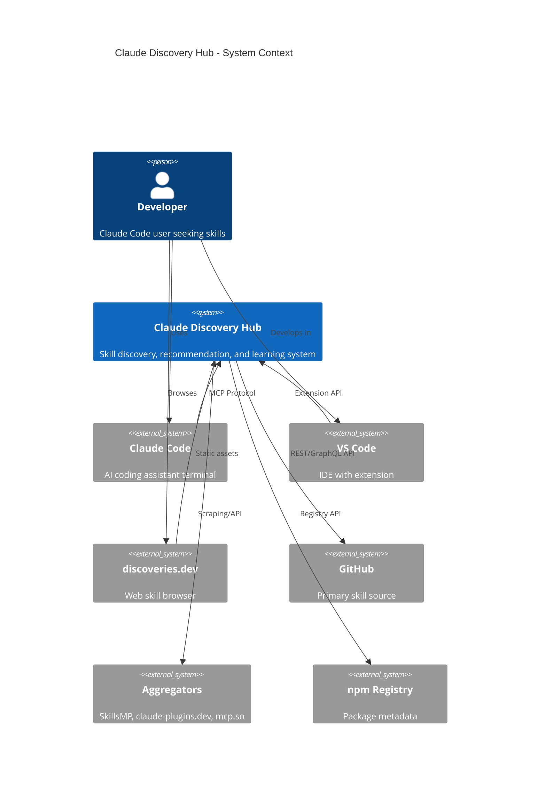
```mermaid
C4Context
    title Claude Discovery Hub - System Context

    Person(dev, "Developer", "Claude Code user seeking skills")

    System(hub, "Claude Discovery Hub", "Skill discovery, recommendation, and learning system")

    System_Ext(claude, "Claude Code", "AI coding assistant terminal")
    System_Ext(vscode, "VS Code", "IDE with extension")
    System_Ext(web, "discoveries.dev", "Web skill browser")

    System_Ext(github, "GitHub", "Primary skill source")
    System_Ext(aggregators, "Aggregators", "SkillsMP, claude-plugins.dev, mcp.so")
    System_Ext(npm, "npm Registry", "Package metadata")

    Rel(dev, claude, "Uses")
    Rel(dev, vscode, "Develops in")
    Rel(dev, web, "Browses")

    Rel(claude, hub, "MCP Protocol")
    Rel(vscode, hub, "Extension API")
    Rel(web, hub, "Static assets")

    Rel(hub, github, "REST/GraphQL API")
    Rel(hub, aggregators, "Scraping/API")
    Rel(hub, npm, "Registry API")
```

### 1.2 Simplified System Overview

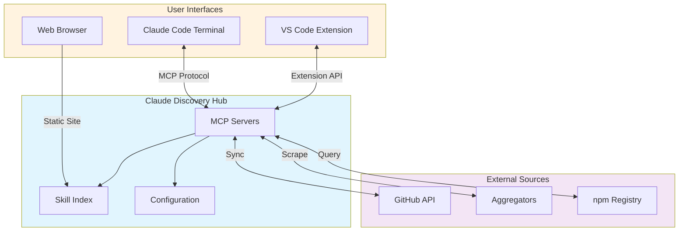
```mermaid
flowchart TB
    subgraph Users["User Interfaces"]
        CC[Claude Code Terminal]
        VSC[VS Code Extension]
        WEB[Web Browser]
    end

    subgraph Hub["Claude Discovery Hub"]
        MCP[MCP Servers]
        IDX[Skill Index]
        CFG[Configuration]
    end

    subgraph External["External Sources"]
        GH[GitHub API]
        AGG[Aggregators]
        NPM[npm Registry]
    end

    CC <-->|MCP Protocol| MCP
    VSC <-->|Extension API| MCP
    WEB -->|Static Site| IDX

    MCP --> IDX
    MCP --> CFG

    MCP <-->|Sync| GH
    MCP <-->|Scrape| AGG
    MCP <-->|Query| NPM

    style Hub fill:#e1f5fe
    style Users fill:#fff3e0
    style External fill:#f3e5f5
```

---

## 2. Container Architecture

### 2.1 Container Diagram (C4 Level 2)

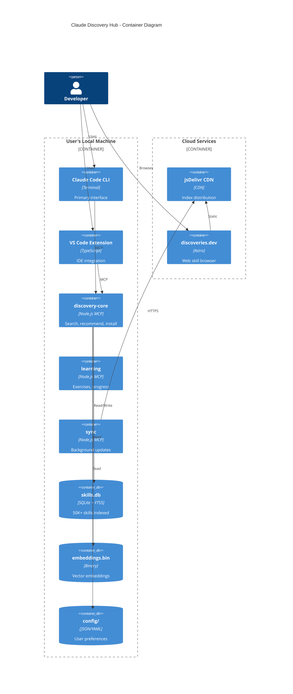
```mermaid
C4Container
    title Claude Discovery Hub - Container Diagram

    Person(dev, "Developer", "")

    Container_Boundary(local, "User's Local Machine") {
        Container(cli, "Claude Code CLI", "Terminal", "Primary interface")
        Container(ext, "VS Code Extension", "TypeScript", "IDE integration")

        Container(dc, "discovery-core", "Node.js MCP", "Search, recommend, install")
        Container(learn, "learning", "Node.js MCP", "Exercises, progress")
        Container(sync, "sync", "Node.js MCP", "Background updates")

        ContainerDb(db, "skills.db", "SQLite + FTS5", "50K+ skills indexed")
        ContainerDb(embed, "embeddings.bin", "Binary", "Vector embeddings")
        ContainerDb(cfg, "config/", "JSON/YAML", "User preferences")
    }

    Container_Boundary(cloud, "Cloud Services") {
        Container(cdn, "jsDelivr CDN", "CDN", "Index distribution")
        Container(web, "discoveries.dev", "Astro", "Web skill browser")
    }

    Rel(dev, cli, "Uses")
    Rel(dev, ext, "Uses")
    Rel(dev, web, "Browses")

    Rel(cli, dc, "MCP")
    Rel(ext, dc, "MCP")

    Rel(dc, db, "Read/Write")
    Rel(dc, embed, "Read")
    Rel(dc, cfg, "Read")

    Rel(sync, cdn, "HTTPS")
    Rel(web, cdn, "Static")
```

### 2.2 MCP Server Architecture

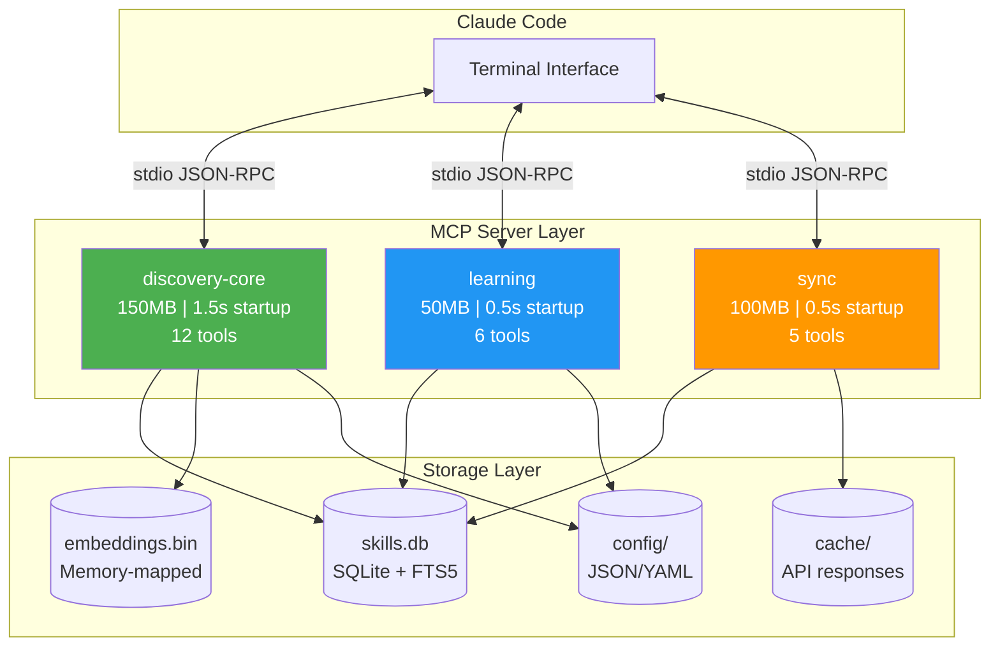
```mermaid
flowchart TB
    subgraph Claude["Claude Code"]
        CLI[Terminal Interface]
    end

    subgraph MCP["MCP Server Layer"]
        DC["discovery-core<br/>150MB | 1.5s startup<br/>12 tools"]
        LN["learning<br/>50MB | 0.5s startup<br/>6 tools"]
        SY["sync<br/>100MB | 0.5s startup<br/>5 tools"]
    end

    subgraph Storage["Storage Layer"]
        DB[(skills.db<br/>SQLite + FTS5)]
        EM[(embeddings.bin<br/>Memory-mapped)]
        CF[(config/<br/>JSON/YAML)]
        CA[(cache/<br/>API responses)]
    end

    CLI <-->|stdio JSON-RPC| DC
    CLI <-->|stdio JSON-RPC| LN
    CLI <-->|stdio JSON-RPC| SY

    DC --> DB
    DC --> EM
    DC --> CF

    LN --> DB
    LN --> CF

    SY --> DB
    SY --> CA

    style DC fill:#4caf50,color:#fff
    style LN fill:#2196f3,color:#fff
    style SY fill:#ff9800,color:#fff
```

---

## 3. MCP Server Components

### 3.1 discovery-core Internal Architecture

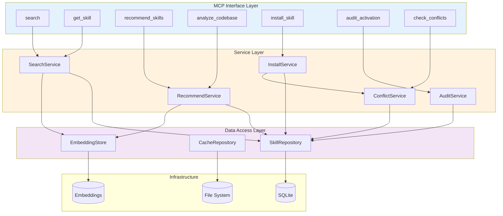
```mermaid
flowchart TB
    subgraph Interface["MCP Interface Layer"]
        T1[search]
        T2[get_skill]
        T3[recommend_skills]
        T4[analyze_codebase]
        T5[install_skill]
        T6[audit_activation]
        T7[check_conflicts]
    end

    subgraph Services["Service Layer"]
        SS[SearchService]
        RS[RecommendService]
        IS[InstallService]
        AS[AuditService]
        CS[ConflictService]
    end

    subgraph DAL["Data Access Layer"]
        SR[SkillRepository]
        CR[CacheRepository]
        ES[EmbeddingStore]
    end

    subgraph Infra["Infrastructure"]
        DB[(SQLite)]
        EMB[(Embeddings)]
        FS[(File System)]
    end

    T1 & T2 --> SS
    T3 & T4 --> RS
    T5 --> IS
    T6 --> AS
    T7 --> CS

    SS --> SR & ES
    RS --> SR & ES
    IS --> SR & CS
    AS --> SR
    CS --> SR

    SR --> DB
    ES --> EMB
    CR --> FS

    style Interface fill:#e3f2fd
    style Services fill:#fff3e0
    style DAL fill:#f3e5f5
```

### 3.2 Service Dependencies

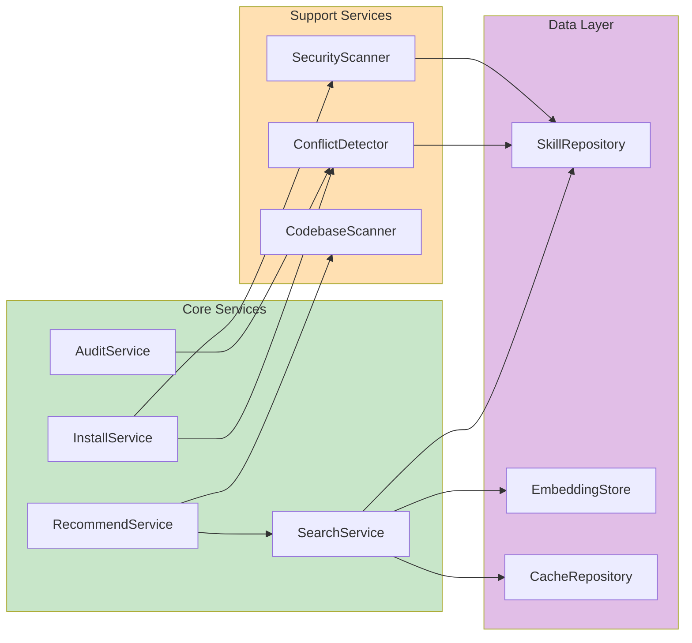
```mermaid
graph LR
    subgraph Core["Core Services"]
        Search[SearchService]
        Recommend[RecommendService]
        Install[InstallService]
        Audit[AuditService]
    end

    subgraph Support["Support Services"]
        Conflict[ConflictDetector]
        Security[SecurityScanner]
        Scanner[CodebaseScanner]
    end

    subgraph Data["Data Layer"]
        Repo[SkillRepository]
        Embed[EmbeddingStore]
        Cache[CacheRepository]
    end

    Recommend --> Search
    Recommend --> Scanner
    Install --> Conflict
    Install --> Security
    Audit --> Conflict

    Search --> Repo & Embed & Cache
    Conflict --> Repo
    Security --> Repo

    style Core fill:#c8e6c9
    style Support fill:#ffe0b2
    style Data fill:#e1bee7
```

---

## 4. Data Flow Diagrams

### 4.1 Search Request Flow

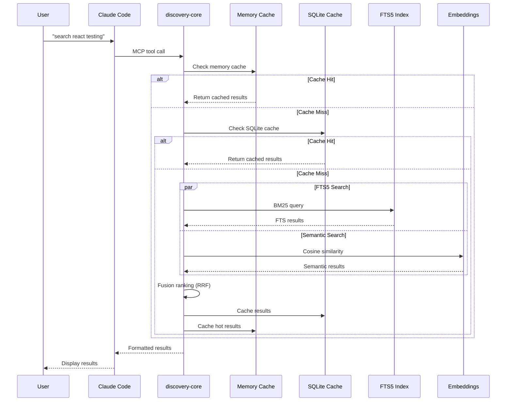
```mermaid
sequenceDiagram
    participant U as User
    participant CC as Claude Code
    participant DC as discovery-core
    participant L1 as Memory Cache
    participant L2 as SQLite Cache
    participant FTS as FTS5 Index
    participant EMB as Embeddings

    U->>CC: "search react testing"
    CC->>DC: MCP tool call
    DC->>L1: Check memory cache

    alt Cache Hit
        L1-->>DC: Return cached results
    else Cache Miss
        DC->>L2: Check SQLite cache
        alt Cache Hit
            L2-->>DC: Return cached results
        else Cache Miss
            par FTS5 Search
                DC->>FTS: BM25 query
                FTS-->>DC: FTS results
            and Semantic Search
                DC->>EMB: Cosine similarity
                EMB-->>DC: Semantic results
            end
            DC->>DC: Fusion ranking (RRF)
            DC->>L2: Cache results
            DC->>L1: Cache hot results
        end
    end

    DC-->>CC: Formatted results
    CC-->>U: Display results
```

### 4.2 Skill Installation Flow

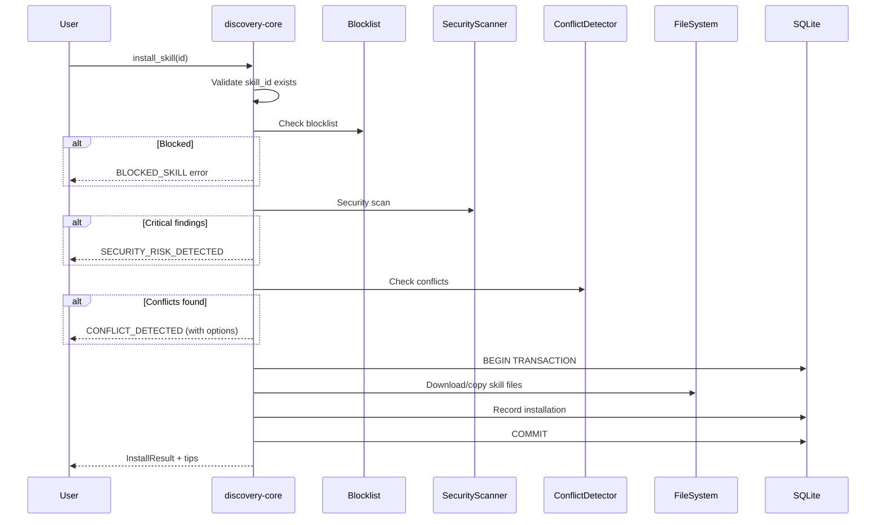
```mermaid
sequenceDiagram
    participant U as User
    participant DC as discovery-core
    participant BL as Blocklist
    participant SS as SecurityScanner
    participant CD as ConflictDetector
    participant FS as FileSystem
    participant DB as SQLite

    U->>DC: install_skill(id)
    DC->>DC: Validate skill_id exists

    DC->>BL: Check blocklist
    alt Blocked
        DC-->>U: BLOCKED_SKILL error
    end

    DC->>SS: Security scan
    alt Critical findings
        DC-->>U: SECURITY_RISK_DETECTED
    end

    DC->>CD: Check conflicts
    alt Conflicts found
        DC-->>U: CONFLICT_DETECTED (with options)
    end

    DC->>DB: BEGIN TRANSACTION
    DC->>FS: Download/copy skill files
    DC->>DB: Record installation
    DC->>DB: COMMIT

    DC-->>U: InstallResult + tips
```

### 4.3 Recommendation Flow

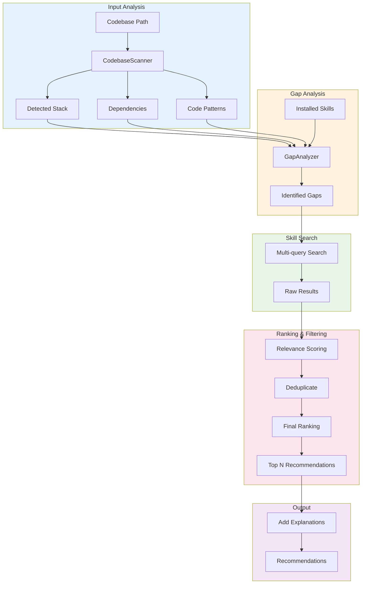
```mermaid
flowchart TB
    subgraph Input["Input Analysis"]
        CB[Codebase Path]
        CB --> SCAN[CodebaseScanner]
        SCAN --> STACK[Detected Stack]
        SCAN --> DEPS[Dependencies]
        SCAN --> PATTERNS[Code Patterns]
    end

    subgraph Analysis["Gap Analysis"]
        STACK & DEPS & PATTERNS --> GAP[GapAnalyzer]
        INST[Installed Skills] --> GAP
        GAP --> GAPS[Identified Gaps]
    end

    subgraph Search["Skill Search"]
        GAPS --> QUERY[Multi-query Search]
        QUERY --> RESULTS[Raw Results]
    end

    subgraph Ranking["Ranking & Filtering"]
        RESULTS --> SCORE[Relevance Scoring]
        SCORE --> DEDUP[Deduplicate]
        DEDUP --> RANK[Final Ranking]
        RANK --> TOP[Top N Recommendations]
    end

    subgraph Output["Output"]
        TOP --> FORMAT[Add Explanations]
        FORMAT --> REC[Recommendations]
    end

    style Input fill:#e3f2fd
    style Analysis fill:#fff3e0
    style Search fill:#e8f5e9
    style Ranking fill:#fce4ec
    style Output fill:#f3e5f5
```

---

## 5. Trust Tier Model

### 5.1 Trust Tier Hierarchy

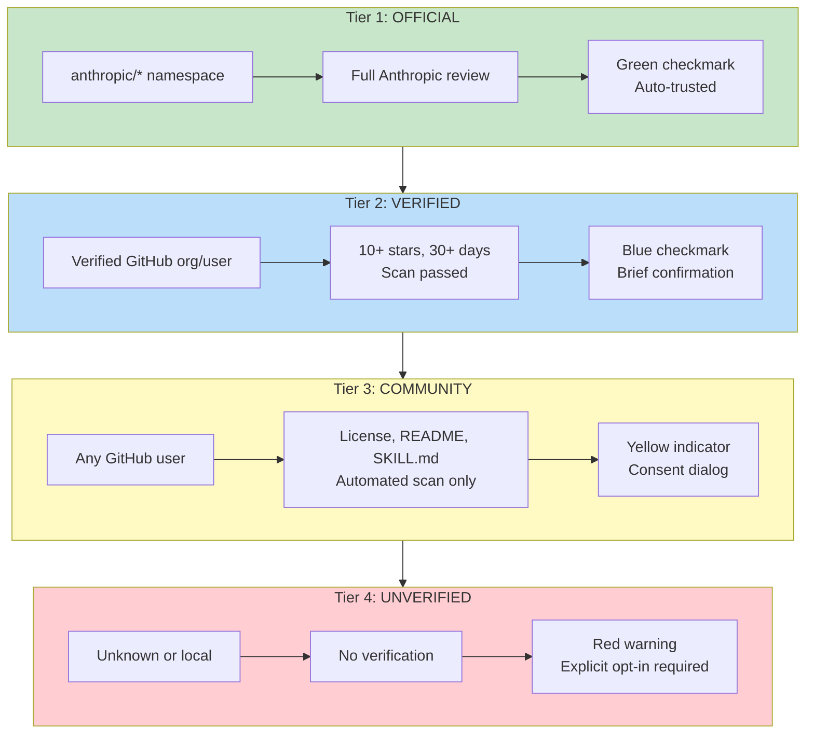
```mermaid
flowchart TB
    subgraph T1["Tier 1: OFFICIAL"]
        O[anthropic/* namespace]
        O --> OV[Full Anthropic review]
        OV --> OB["Green checkmark<br/>Auto-trusted"]
    end

    subgraph T2["Tier 2: VERIFIED"]
        V[Verified GitHub org/user]
        V --> VR["10+ stars, 30+ days<br/>Scan passed"]
        VR --> VB["Blue checkmark<br/>Brief confirmation"]
    end

    subgraph T3["Tier 3: COMMUNITY"]
        C[Any GitHub user]
        C --> CR["License, README, SKILL.md<br/>Automated scan only"]
        CR --> CB["Yellow indicator<br/>Consent dialog"]
    end

    subgraph T4["Tier 4: UNVERIFIED"]
        U[Unknown or local]
        U --> UR[No verification]
        UR --> UB["Red warning<br/>Explicit opt-in required"]
    end

    T1 --> T2 --> T3 --> T4

    style T1 fill:#c8e6c9
    style T2 fill:#bbdefb
    style T3 fill:#fff9c4
    style T4 fill:#ffcdd2
```

### 5.2 Trust Score Calculation

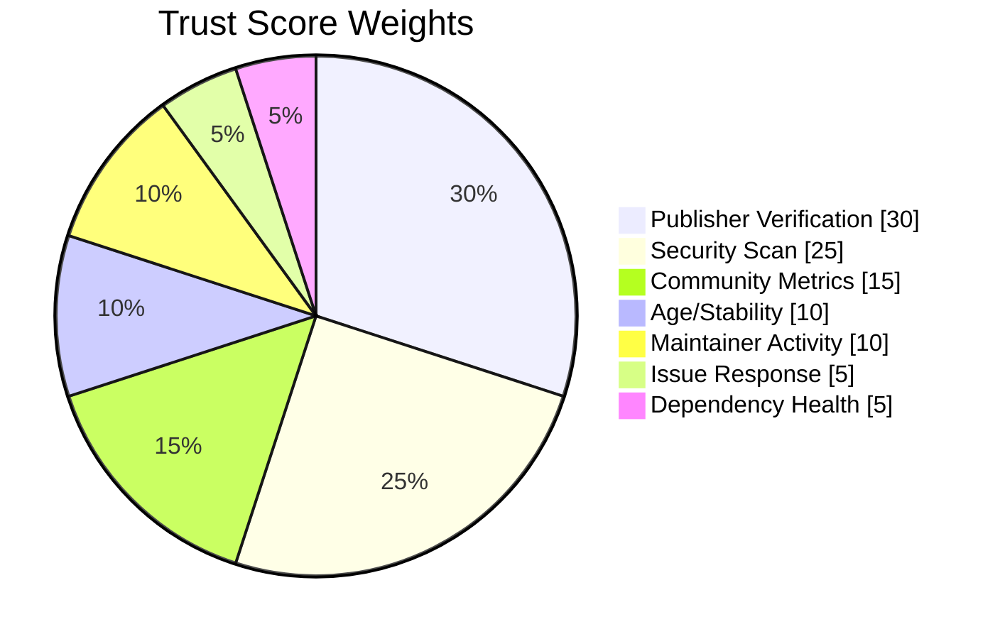
```mermaid
pie showData
    title Trust Score Weights
    "Publisher Verification" : 30
    "Security Scan" : 25
    "Community Metrics" : 15
    "Age/Stability" : 10
    "Maintainer Activity" : 10
    "Issue Response" : 5
    "Dependency Health" : 5
```

### 5.3 Verification Workflow

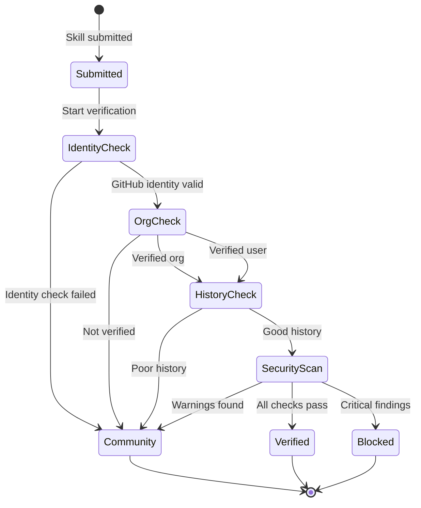
```mermaid
stateDiagram-v2
    [*] --> Submitted: Skill submitted

    Submitted --> IdentityCheck: Start verification

    IdentityCheck --> OrgCheck: GitHub identity valid
    IdentityCheck --> Community: Identity check failed

    OrgCheck --> HistoryCheck: Verified org
    OrgCheck --> HistoryCheck: Verified user
    OrgCheck --> Community: Not verified

    HistoryCheck --> SecurityScan: Good history
    HistoryCheck --> Community: Poor history

    SecurityScan --> Verified: All checks pass
    SecurityScan --> Community: Warnings found
    SecurityScan --> Blocked: Critical findings

    Community --> [*]
    Verified --> [*]
    Blocked --> [*]
```

---

## 6. Sync Architecture

### 6.1 Multi-Source Sync Pipeline

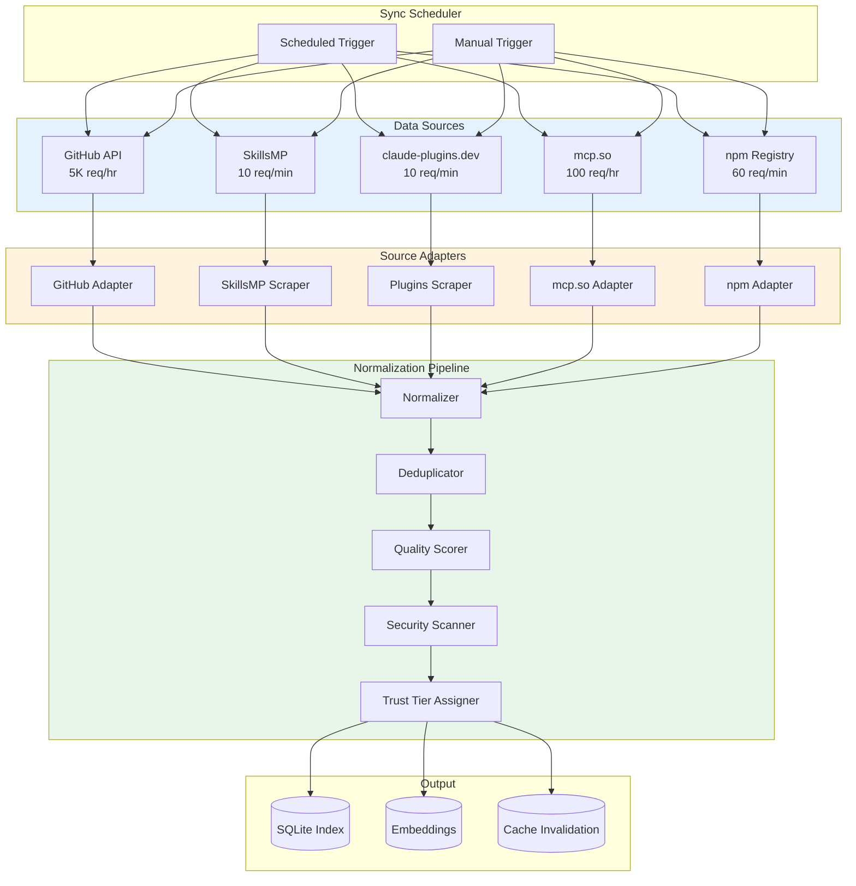
```mermaid
flowchart TB
    subgraph Scheduler["Sync Scheduler"]
        CRON[Scheduled Trigger]
        MANUAL[Manual Trigger]
    end

    subgraph Sources["Data Sources"]
        GH[GitHub API<br/>5K req/hr]
        SMP[SkillsMP<br/>10 req/min]
        CP[claude-plugins.dev<br/>10 req/min]
        MCP[mcp.so<br/>100 req/hr]
        NPM[npm Registry<br/>60 req/min]
    end

    subgraph Adapters["Source Adapters"]
        GHA[GitHub Adapter]
        SMPA[SkillsMP Scraper]
        CPA[Plugins Scraper]
        MCPA[mcp.so Adapter]
        NPMA[npm Adapter]
    end

    subgraph Pipeline["Normalization Pipeline"]
        NORM[Normalizer]
        DEDUP[Deduplicator]
        SCORE[Quality Scorer]
        SCAN[Security Scanner]
        TRUST[Trust Tier Assigner]
    end

    subgraph Output["Output"]
        DB[(SQLite Index)]
        EMB[(Embeddings)]
        CACHE[(Cache Invalidation)]
    end

    CRON & MANUAL --> GH & SMP & CP & MCP & NPM

    GH --> GHA
    SMP --> SMPA
    CP --> CPA
    MCP --> MCPA
    NPM --> NPMA

    GHA & SMPA & CPA & MCPA & NPMA --> NORM
    NORM --> DEDUP --> SCORE --> SCAN --> TRUST

    TRUST --> DB
    TRUST --> EMB
    TRUST --> CACHE

    style Sources fill:#e3f2fd
    style Adapters fill:#fff3e0
    style Pipeline fill:#e8f5e9
```

### 6.2 Sync State Machine

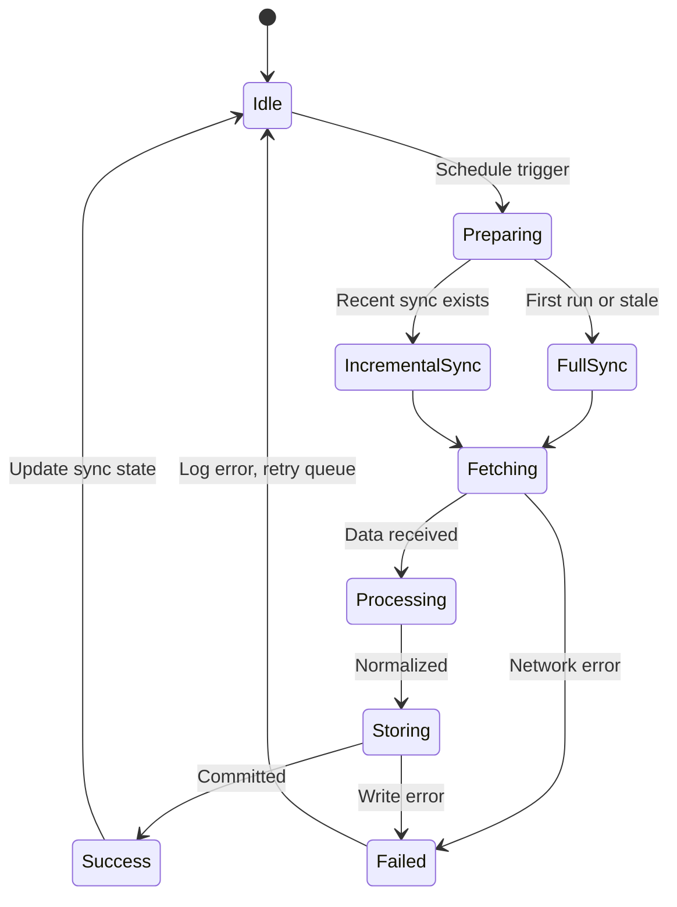
```mermaid
stateDiagram-v2
    [*] --> Idle

    Idle --> Preparing: Schedule trigger

    Preparing --> FullSync: First run or stale
    Preparing --> IncrementalSync: Recent sync exists

    FullSync --> Fetching
    IncrementalSync --> Fetching

    Fetching --> Processing: Data received
    Fetching --> Failed: Network error

    Processing --> Storing: Normalized

    Storing --> Success: Committed
    Storing --> Failed: Write error

    Success --> Idle: Update sync state
    Failed --> Idle: Log error, retry queue
```

### 6.3 Incremental Update Flow

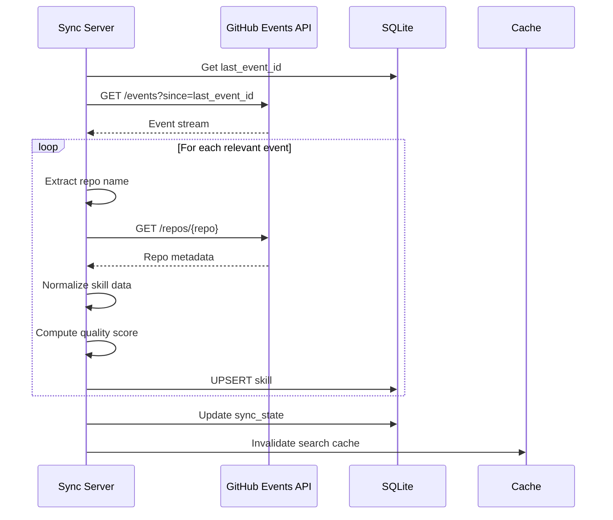
```mermaid
sequenceDiagram
    participant S as Sync Server
    participant GH as GitHub Events API
    participant DB as SQLite
    participant C as Cache

    S->>DB: Get last_event_id
    S->>GH: GET /events?since=last_event_id
    GH-->>S: Event stream

    loop For each relevant event
        S->>S: Extract repo name
        S->>GH: GET /repos/{repo}
        GH-->>S: Repo metadata
        S->>S: Normalize skill data
        S->>S: Compute quality score
        S->>DB: UPSERT skill
    end

    S->>DB: Update sync_state
    S->>C: Invalidate search cache
```

---

## 7. Storage Architecture

### 7.1 Directory Structure

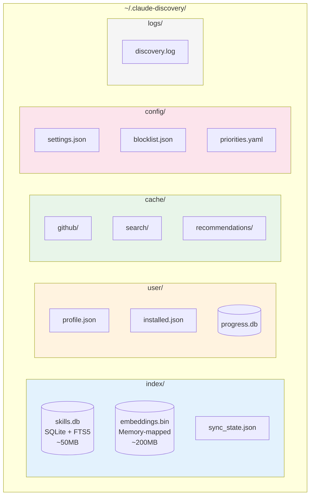
```mermaid
flowchart TB
    subgraph Root["~/.claude-discovery/"]
        subgraph Index["index/"]
            DB[("skills.db<br/>SQLite + FTS5<br/>~50MB")]
            EMB[("embeddings.bin<br/>Memory-mapped<br/>~200MB")]
            SS[sync_state.json]
        end

        subgraph User["user/"]
            PROF[profile.json]
            INST[installed.json]
            PROG[("progress.db")]
        end

        subgraph Cache["cache/"]
            GHC[github/]
            SRC[search/]
            REC[recommendations/]
        end

        subgraph Config["config/"]
            SET[settings.json]
            BL[blocklist.json]
            PRI[priorities.yaml]
        end

        subgraph Logs["logs/"]
            LOG[discovery.log]
        end
    end

    style Index fill:#e3f2fd
    style User fill:#fff3e0
    style Cache fill:#e8f5e9
    style Config fill:#fce4ec
    style Logs fill:#f5f5f5
```

### 7.2 SQLite Schema Overview

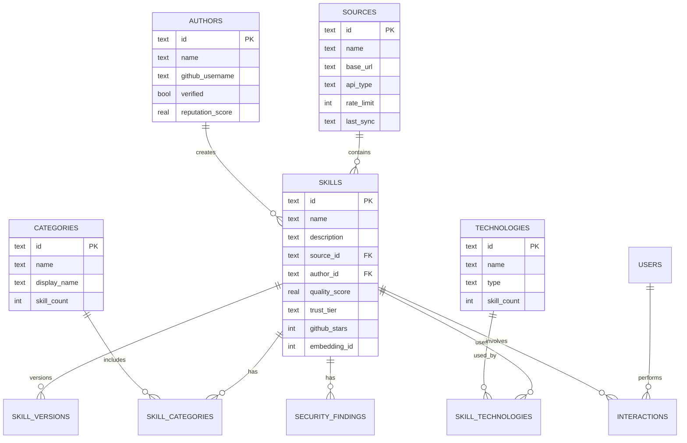
```mermaid
erDiagram
    SOURCES ||--o{ SKILLS : contains
    AUTHORS ||--o{ SKILLS : creates
    SKILLS ||--o{ SKILL_CATEGORIES : has
    SKILLS ||--o{ SKILL_TECHNOLOGIES : uses
    SKILLS ||--o{ SKILL_VERSIONS : versions
    CATEGORIES ||--o{ SKILL_CATEGORIES : includes
    TECHNOLOGIES ||--o{ SKILL_TECHNOLOGIES : used_by
    SKILLS ||--o{ SECURITY_FINDINGS : has
    USERS ||--o{ INTERACTIONS : performs
    SKILLS ||--o{ INTERACTIONS : involves

    SOURCES {
        text id PK
        text name
        text base_url
        text api_type
        int rate_limit
        text last_sync
    }

    SKILLS {
        text id PK
        text name
        text description
        text source_id FK
        text author_id FK
        real quality_score
        text trust_tier
        int github_stars
        int embedding_id
    }

    AUTHORS {
        text id PK
        text name
        text github_username
        bool verified
        real reputation_score
    }

    CATEGORIES {
        text id PK
        text name
        text display_name
        int skill_count
    }

    TECHNOLOGIES {
        text id PK
        text name
        text type
        int skill_count
    }
```

### 7.3 Cache Architecture

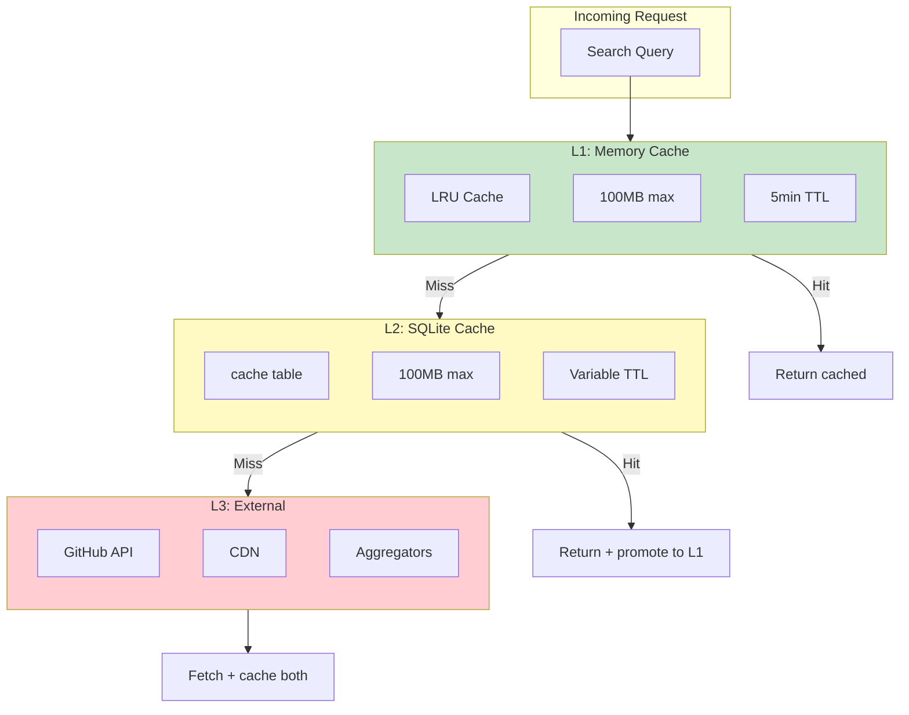
```mermaid
flowchart TB
    subgraph Request["Incoming Request"]
        REQ[Search Query]
    end

    subgraph L1["L1: Memory Cache"]
        direction TB
        M1[LRU Cache]
        M2[100MB max]
        M3[5min TTL]
    end

    subgraph L2["L2: SQLite Cache"]
        direction TB
        S1[cache table]
        S2[100MB max]
        S3[Variable TTL]
    end

    subgraph L3["L3: External"]
        direction TB
        E1[GitHub API]
        E2[CDN]
        E3[Aggregators]
    end

    REQ --> L1
    L1 -->|Hit| RES1[Return cached]
    L1 -->|Miss| L2
    L2 -->|Hit| RES2[Return + promote to L1]
    L2 -->|Miss| L3
    L3 --> RES3[Fetch + cache both]

    style L1 fill:#c8e6c9
    style L2 fill:#fff9c4
    style L3 fill:#ffcdd2
```

---

## 8. Deployment Pipeline

### 8.1 CI/CD Pipeline

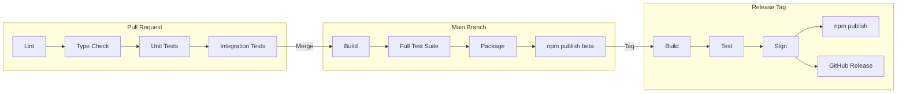
```mermaid
flowchart LR
    subgraph PR["Pull Request"]
        LINT[Lint]
        TYPE[Type Check]
        UNIT[Unit Tests]
        INT[Integration Tests]
    end

    subgraph Main["Main Branch"]
        BUILD[Build]
        TEST[Full Test Suite]
        PKG[Package]
        BETA[npm publish beta]
    end

    subgraph Release["Release Tag"]
        RBUILD[Build]
        RTEST[Test]
        SIGN[Sign]
        NPM[npm publish]
        GHR[GitHub Release]
    end

    LINT --> TYPE --> UNIT --> INT
    INT -->|Merge| BUILD --> TEST --> PKG --> BETA
    BETA -->|Tag| RBUILD --> RTEST --> SIGN --> NPM & GHR
```

### 8.2 Index Generation Pipeline

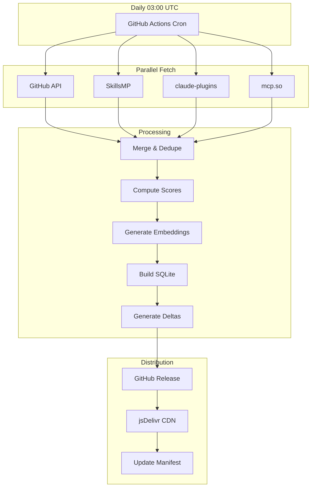
```mermaid
flowchart TB
    subgraph Trigger["Daily 03:00 UTC"]
        CRON[GitHub Actions Cron]
    end

    subgraph Fetch["Parallel Fetch"]
        GH[GitHub API]
        SMP[SkillsMP]
        CP[claude-plugins]
        MCP[mcp.so]
    end

    subgraph Process["Processing"]
        MERGE[Merge & Dedupe]
        SCORE[Compute Scores]
        EMBED[Generate Embeddings]
        BUILD[Build SQLite]
        DELTA[Generate Deltas]
    end

    subgraph Deploy["Distribution"]
        GHR[GitHub Release]
        CDN[jsDelivr CDN]
        MAN[Update Manifest]
    end

    CRON --> GH & SMP & CP & MCP
    GH & SMP & CP & MCP --> MERGE
    MERGE --> SCORE --> EMBED --> BUILD --> DELTA
    DELTA --> GHR --> CDN --> MAN
```

### 8.3 Update Distribution

```mermaid
sequenceDiagram
    participant U as User Machine
    participant S as Sync Server
    participant CDN as jsDelivr CDN
    participant GH as GitHub Releases

    Note over S: Background check (daily)
    S->>CDN: GET manifest.json
    CDN-->>S: {version, checksums, urls}

    alt Update Available
        S->>S: Compare versions

        alt Delta Available
            S->>CDN: GET delta-v1-v2.patch
            CDN-->>S: Delta patch (~500KB)
            S->>U: Apply patch to skills.db
        else Full Sync Required
            S->>CDN: GET skills.db
            CDN-->>S: Full database (~25MB)
            S->>U: Replace skills.db
        end

        S->>U: Verify checksum
        S->>U: Rebuild FTS5 index
        S->>U: Invalidate caches
    end
```

---

## 9. User Journey Flows

### 9.1 Discovery Journey

```mermaid
journey
    title Skill Discovery Journey
    section Awareness
      See skill attribution in response: 5: Developer
      Notice skill quality badge: 4: Developer
    section Discovery
      Search for specific skill: 5: Developer
      Browse recommendations: 4: Developer
      Compare similar skills: 4: Developer
    section Evaluation
      View skill details: 5: Developer
      Check trust tier: 5: Developer
      Review quality score: 4: Developer
    section Adoption
      Install skill: 5: Developer
      Configure skill: 3: Developer
      First activation: 5: Developer
    section Mastery
      Complete exercises: 4: Developer
      Track progress: 4: Developer
```

### 9.2 Installation Decision Flow

```mermaid
flowchart TB
    START[User wants to install skill]

    START --> SEARCH{How found?}

    SEARCH -->|Search| RESULTS[View search results]
    SEARCH -->|Recommendation| REC[View recommendation]
    SEARCH -->|Web| WEB[discoveries.dev]

    RESULTS & REC & WEB --> DETAIL[View skill detail]

    DETAIL --> CHECK{Evaluate}

    CHECK --> TRUST{Trust tier?}
    TRUST -->|Official/Verified| QUICK[Quick install]
    TRUST -->|Community| REVIEW[Review warnings]
    TRUST -->|Unverified| CAUTION[Strong warning]

    REVIEW --> CONFLICT{Conflicts?}
    CAUTION --> CONFLICT

    CONFLICT -->|Yes| RESOLVE[Resolve conflicts]
    CONFLICT -->|No| INSTALL

    RESOLVE --> INSTALL[Install skill]
    QUICK --> INSTALL

    INSTALL --> SUCCESS[Installation complete]
    SUCCESS --> TIPS[Show activation tips]
```

### 9.3 Activation Troubleshooting Flow

```mermaid
flowchart TB
    START[Skill not activating]

    START --> AUDIT[Run audit_activation]

    AUDIT --> ISSUES{Issues found?}

    ISSUES -->|YAML errors| FIX_YAML[Fix frontmatter]
    ISSUES -->|Missing triggers| ADD_TRIGGERS[Add trigger phrases]
    ISSUES -->|Budget exceeded| MANAGE_BUDGET[Remove other skills]
    ISSUES -->|Conflicts| RESOLVE_CONFLICT[Set priorities]
    ISSUES -->|None found| MANUAL[Manual investigation]

    FIX_YAML & ADD_TRIGGERS & MANAGE_BUDGET & RESOLVE_CONFLICT --> RETEST[Test activation]

    RETEST --> WORKS{Working?}
    WORKS -->|Yes| SUCCESS[Success!]
    WORKS -->|No| AUDIT

    MANUAL --> COMMUNITY[Ask community]
```

---

## 10. Security Architecture

### 10.1 Security Boundaries

```mermaid
flowchart TB
    subgraph Trusted["TRUSTED ZONE"]
        ANTHROPIC[Anthropic Platform]
        CLAUDE[Claude Code Runtime]
        OS[OS File Permissions]
    end

    subgraph SemiTrusted["SEMI-TRUSTED ZONE"]
        HUB[Discovery Hub]
        INDEX[Skill Index]
        SCAN[Static Analysis]
        TRUST[Trust Tiers]
    end

    subgraph Untrusted["UNTRUSTED ZONE"]
        GH[GitHub Repos]
        AGG[Aggregators]
        AUTHORS[Skill Authors]
    end

    Untrusted -->|Ingest + Scan| SemiTrusted
    SemiTrusted -->|Load Skills| Trusted

    style Trusted fill:#c8e6c9
    style SemiTrusted fill:#fff9c4
    style Untrusted fill:#ffcdd2
```

### 10.2 Security Scan Pipeline

```mermaid
flowchart TB
    INPUT[Skill Content]

    INPUT --> S1[Stage 1: Pattern Match]
    S1 --> P1{Jailbreak patterns?}
    P1 -->|Yes| BLOCK1[BLOCK]
    P1 -->|No| S2

    S2[Stage 2: URL Analysis]
    S2 --> P2{Suspicious URLs?}
    P2 -->|Yes| WARN1[HIGH SEVERITY]
    P2 -->|No| S3

    S3[Stage 3: Blocklist Check]
    S3 --> P3{On blocklist?}
    P3 -->|Yes| BLOCK2[BLOCK]
    P3 -->|No| S4

    S4[Stage 4: Typosquatting]
    S4 --> P4{Similar to popular?}
    P4 -->|High confidence| BLOCK3[BLOCK]
    P4 -->|Medium| WARN2[WARNING]
    P4 -->|Low| S5

    S5[Stage 5: Entropy Analysis]
    S5 --> P5{Obfuscation?}
    P5 -->|Yes| WARN3[REVIEW]
    P5 -->|No| PASS[PASS]

    WARN1 & WARN2 & WARN3 --> SCORE[Risk Score]
    SCORE --> FINAL{Score > 70?}
    FINAL -->|Yes| BLOCK4[BLOCK]
    FINAL -->|No| ALLOW[ALLOW with warnings]

    style BLOCK1 fill:#f44336,color:#fff
    style BLOCK2 fill:#f44336,color:#fff
    style BLOCK3 fill:#f44336,color:#fff
    style BLOCK4 fill:#f44336,color:#fff
    style WARN1 fill:#ff9800,color:#fff
    style WARN2 fill:#ff9800,color:#fff
    style WARN3 fill:#ff9800,color:#fff
    style PASS fill:#4caf50,color:#fff
    style ALLOW fill:#8bc34a,color:#fff
```

### 10.3 Conflict Detection

```mermaid
flowchart TB
    subgraph Detection["Conflict Detection"]
        SKILLS[Installed Skills]
        SKILLS --> TRIGGER[Extract Triggers]
        SKILLS --> OUTPUT[Extract Outputs]
        SKILLS --> BEHAVIOR[Extract Behaviors]

        TRIGGER --> TC[Trigger Overlap<br/>Jaccard + Cosine]
        OUTPUT --> OC[Output Collision<br/>Path Analysis]
        BEHAVIOR --> BC[Behavioral Conflict<br/>Semantic Analysis]
    end

    subgraph Classification["Conflict Classification"]
        TC --> HIGH1{Similarity > 0.85?}
        HIGH1 -->|Yes| H1[HIGH: Likely conflict]
        HIGH1 -->|No| MED1{> 0.70?}
        MED1 -->|Yes| M1[MEDIUM: Possible]
        MED1 -->|No| LOW1[LOW: Monitor]

        OC --> H2[HIGH: File collision]
        BC --> H3[HIGH: Contradictory guidance]
    end

    subgraph Resolution["Resolution"]
        H1 & H2 & H3 --> PROMPT[Prompt User]
        M1 --> WARN[Show Warning]
        LOW1 --> LOG[Log Only]

        PROMPT --> CHOICES{User Choice}
        CHOICES --> P1[Set Priority]
        CHOICES --> P2[Disable Skill]
        CHOICES --> P3[Proceed Anyway]
    end
```

---

## 11. Performance Visualization

### 11.1 Latency Targets

```mermaid
gantt
    title Latency Targets (milliseconds)
    dateFormat X
    axisFormat %s

    section Search
    Cached (p50)     :done, 0, 50
    Cached (p95)     :done, 0, 150
    Uncached (p50)   :active, 0, 200
    Uncached (p95)   :active, 0, 400

    section Recommend
    p50              :active, 0, 300
    p95              :active, 0, 1000

    section Install
    p50              :crit, 0, 1000
    p95              :crit, 0, 3000
```

### 11.2 Memory Budget

```mermaid
pie showData
    title Memory Budget (500MB Total)
    "discovery-core" : 150
    "learning" : 50
    "sync" : 100
    "SQLite Cache" : 100
    "Embeddings (resident)" : 50
    "Headroom" : 50
```

---

## Document History

| Version | Date | Author | Changes |
|---------|------|--------|---------|
| 1.0 | December 26, 2025 | Senior Architect | Initial Mermaid diagrams |

---

*These diagrams are rendered by any Mermaid-compatible viewer including GitHub, VS Code (with extension), and most documentation platforms.*
