# Skill Dependency Graph

This document maps the dependencies between Claude Code skills, including tool requirements, environment variables, and inter-skill relationships.

## Overview

Skills can depend on:
- **External Tools** - CLI tools that must be installed (Docker, git, Playwright)
- **Environment Variables** - API keys or configuration required at runtime
- **Other Skills** - Skills that provide foundational capabilities
- **Framework/Runtime** - Node.js, Bun, or specific frameworks

## Dependency Legend

| Symbol | Meaning |
|--------|---------|
| Solid arrow | Required dependency |
| Dashed arrow | Optional/enhanced dependency |
| Box colors | Skill category (see diagram) |

---

## Complete Dependency Graph

```mermaid
flowchart TB
    subgraph Tools["External Tools"]
        docker["Docker"]
        git["Git"]
        playwright["Playwright/Chromium"]
        bun["Bun Runtime"]
        node["Node.js"]
        vercel-cli["Vercel CLI"]
        gh-cli["GitHub CLI (gh)"]
        linear-cli["Linear CLI"]
    end

    subgraph EnvVars["Environment Variables"]
        linear-key["LINEAR_API_KEY"]
        clerk-keys["CLERK_SECRET_KEY\nPUBLIC_CLERK_PUBLISHABLE_KEY"]
        vercel-token["VERCEL_TOKEN\nVERCEL_ORG_ID\nVERCEL_PROJECT_ID"]
        varlock-env[".env + .env.schema"]
    end

    subgraph CoreSkills["Core Skills (No Skill Dependencies)"]
        skill-docker["docker"]
        skill-varlock["varlock"]
        skill-linear["linear"]
    end

    subgraph FrameworkSkills["Framework Skills"]
        skill-astro["astro"]
        skill-clerk["clerk"]
        skill-vercel["vercel-github-actions"]
    end

    subgraph AutomationSkills["Automation Skills"]
        skill-dev-browser["dev-browser"]
        skill-doc-screenshots["doc-screenshots"]
    end

    subgraph QualitySkills["Quality & Design Skills"]
        skill-governance["governance"]
        skill-e2e["e2e-patterns"]
        skill-021-design["021-design"]
    end

    %% Tool dependencies
    docker --> skill-docker
    git --> skill-governance
    git --> skill-vercel
    playwright --> skill-dev-browser
    bun --> skill-dev-browser
    node --> skill-linear
    vercel-cli --> skill-vercel
    gh-cli --> skill-vercel
    linear-cli -.-> skill-linear
    playwright --> skill-e2e

    %% Environment variable dependencies
    linear-key --> skill-linear
    clerk-keys --> skill-clerk
    vercel-token --> skill-vercel
    varlock-env --> skill-varlock

    %% Inter-skill dependencies (required)
    skill-dev-browser --> skill-doc-screenshots

    %% Inter-skill dependencies (optional/enhanced)
    skill-docker -.-> skill-governance
    skill-clerk -.-> skill-e2e
    skill-dev-browser -.-> skill-021-design
    skill-doc-screenshots -.-> skill-021-design
    skill-astro -.-> skill-clerk
    skill-varlock -.-> skill-docker

    %% Styling
    classDef tool fill:#e1f5fe,stroke:#01579b
    classDef env fill:#fff3e0,stroke:#e65100
    classDef core fill:#e8f5e9,stroke:#2e7d32
    classDef framework fill:#f3e5f5,stroke:#7b1fa2
    classDef automation fill:#fce4ec,stroke:#c2185b
    classDef quality fill:#fffde7,stroke:#f9a825

    class docker,git,playwright,bun,node,vercel-cli,gh-cli,linear-cli tool
    class linear-key,clerk-keys,vercel-token,varlock-env env
    class skill-docker,skill-varlock,skill-linear core
    class skill-astro,skill-clerk,skill-vercel framework
    class skill-dev-browser,skill-doc-screenshots automation
    class skill-governance,skill-e2e,skill-021-design quality
```



---

## Skill Details

### Core Skills (No Skill Dependencies)

These skills are foundational and do not depend on other skills.

#### docker

**Location:** `~/.claude/skills/docker/`

| Dependency Type | Requirement | Required? |
|-----------------|-------------|-----------|
| External Tool | Docker Desktop/Engine | Yes |
| External Tool | docker-compose | Yes |

**Dependents:** governance (project-level), varlock (Docker integration)

---

#### varlock

**Location:** `~/.claude/skills/varlock/`

| Dependency Type | Requirement | Required? |
|-----------------|-------------|-----------|
| External Tool | Varlock CLI | Yes |
| Files | `.env.schema` | Yes |
| Files | `.env` | Yes |

**Dependents:** None (utility skill)

---

#### linear

**Location:** `~/.claude/skills/linear/`

| Dependency Type | Requirement | Required? |
|-----------------|-------------|-----------|
| Environment Variable | `LINEAR_API_KEY` | Yes |
| External Tool | Node.js | Yes |
| NPM Package | `@linear/sdk` | Optional |
| External Tool | Linear CLI | Optional |
| MCP Server | `mcp.linear.app` | Optional |

**Dependents:** None

---

### Framework Skills

#### astro

**Location:** `~/.claude/skills/astro/`

| Dependency Type | Requirement | Required? |
|-----------------|-------------|-----------|
| NPM Package | `astro` | Yes |
| NPM Package | `@astrojs/vercel` | For SSR |

**Related Skills:** clerk (authentication integration)

---

#### clerk

**Location:** `~/.claude/skills/clerk/`

| Dependency Type | Requirement | Required? |
|-----------------|-------------|-----------|
| Environment Variable | `CLERK_SECRET_KEY` | Yes |
| Environment Variable | `PUBLIC_CLERK_PUBLISHABLE_KEY` | Yes |
| NPM Package | `@clerk/astro` or `@clerk/nextjs` | Yes |
| NPM Package | `@clerk/backend` | For testing |

**Related Skills:** astro (framework), e2e-patterns (test fixtures)

---

#### vercel-github-actions

**Location:** `~/.claude/skills/vercel-github-actions/`

| Dependency Type | Requirement | Required? |
|-----------------|-------------|-----------|
| Environment Variable | `VERCEL_TOKEN` | Yes |
| Environment Variable | `VERCEL_ORG_ID` | Yes |
| Environment Variable | `VERCEL_PROJECT_ID` | Yes |
| External Tool | Vercel CLI | Yes |
| External Tool | Git | Yes |
| External Tool | GitHub CLI (gh) | Optional |

**Dependents:** None

---

### Automation Skills

#### dev-browser

**Location:** `~/.claude/skills/dev-browser/`

| Dependency Type | Requirement | Required? |
|-----------------|-------------|-----------|
| External Tool | Bun | Yes |
| External Tool | Playwright | Yes |
| External Tool | Chromium | Yes (auto-installed) |

**Dependents:** doc-screenshots (required), 021-design (optional)

**Startup Command:**
```bash
~/.claude/skills/dev-browser/server.sh &
```

---

#### doc-screenshots

**Location:** `~/.claude/skills/doc-screenshots/`

| Dependency Type | Requirement | Required? |
|-----------------|-------------|-----------|
| **Skill** | dev-browser | **Yes** |
| External Tool | Bun | Yes (via dev-browser) |

**Note:** This skill cannot function without dev-browser running.

---

### Quality & Design Skills

#### governance

**Location:** `~/.claude/skills/governance/`

| Dependency Type | Requirement | Required? |
|-----------------|-------------|-----------|
| External Tool | Git | Yes |
| External Tool | npm/Node.js | Yes |
| Skill | docker | Optional (project-level) |
| Files | `docs/architecture/standards.md` | Recommended |

**Notes:**
- User-level skill uses `npm run` commands directly
- Project-level skill may use `docker exec` prefix for containerized projects

---

#### e2e-patterns

**Location:** `~/.claude/skills/e2e-patterns/`

| Dependency Type | Requirement | Required? |
|-----------------|-------------|-----------|
| External Tool | Playwright | Yes |
| NPM Package | `@playwright/test` | Yes |
| Skill | clerk | Optional (for auth fixtures) |
| External Tool | Docker | Optional |

---

#### 021-design

**Location:** `~/.claude/skills/021-design/`

| Dependency Type | Requirement | Required? |
|-----------------|-------------|-----------|
| Skill | dev-browser | Optional (for inspection) |
| Skill | doc-screenshots | Optional (for reviews) |

---

## Activation Order

When setting up skills for a project, follow this activation order to ensure dependencies are met:

```mermaid
flowchart LR
    subgraph Phase1["Phase 1: Core Tools"]
        docker["Install Docker"]
        git["Install Git"]
        node["Install Node.js"]
        bun["Install Bun"]
    end

    subgraph Phase2["Phase 2: Environment"]
        env-vars["Configure .env files"]
        api-keys["Set API keys"]
    end

    subgraph Phase3["Phase 3: Core Skills"]
        s-docker["docker skill"]
        s-varlock["varlock skill"]
        s-linear["linear skill"]
    end

    subgraph Phase4["Phase 4: Automation"]
        s-dev-browser["dev-browser skill"]
        s-doc-screenshots["doc-screenshots skill"]
    end

    subgraph Phase5["Phase 5: Framework & Quality"]
        s-framework["astro/clerk/vercel skills"]
        s-quality["governance/e2e/design skills"]
    end

    Phase1 --> Phase2
    Phase2 --> Phase3
    Phase3 --> Phase4
    Phase4 --> Phase5
```



---

## Quick Reference: Required Dependencies by Skill

| Skill | Tools | Env Vars | Skills |
|-------|-------|----------|--------|
| docker | Docker | - | - |
| varlock | Varlock CLI | .env files | - |
| linear | Node.js | LINEAR_API_KEY | - |
| astro | - | - | - |
| clerk | - | CLERK_*_KEY | - |
| vercel-github-actions | Vercel CLI, Git | VERCEL_* | - |
| dev-browser | Bun, Playwright | - | - |
| doc-screenshots | - | - | **dev-browser** |
| governance | Git, npm | - | - |
| e2e-patterns | Playwright | - | - |
| 021-design | - | - | - |

---

## Adding New Skills

When creating a new skill, document its dependencies:

1. **In SKILL.md frontmatter:**
   ```yaml
   ---
   name: my-skill
   description: Description here
   dependencies:
     tools:
       - docker  # Required tool
     env_vars:
       - MY_API_KEY  # Required environment variable
     skills:
       - dev-browser  # Required skill dependency
   ---
   ```

2. **Update this document** with the new skill's dependency information

3. **Update the Mermaid diagram** to include the new skill and its relationships

---

## Troubleshooting

### Skill Not Working

1. **Check tool dependencies:**
   ```bash
   which docker git node bun
   ```

2. **Check environment variables:**
   ```bash
   env | grep -E "LINEAR_|CLERK_|VERCEL_"
   ```

3. **Check skill dependencies:**
   - For doc-screenshots: Is dev-browser server running?
   - For governance (project-level): Is Docker container running?

### Missing Dependencies

| Error Pattern | Likely Cause | Fix |
|---------------|--------------|-----|
| `command not found: docker` | Docker not installed | Install Docker Desktop |
| `LINEAR_API_KEY not set` | Missing env var | Set in ~/.claude/.env or shell profile |
| `dev-browser: Connection refused` | Server not running | Run `~/.claude/skills/dev-browser/server.sh &` |
| `Playwright: Browser not found` | Chromium not installed | Run `npx playwright install chromium` |

---

*Last Updated: December 2025*
*Generated from skill analysis for SMI-646*
