# Dependency Map

**Document Type:** Implementation Artifact
**Version:** 1.0
**Date:** December 26, 2025
**Owner:** Systems Architect
**Status:** Ready for Review

---

## Table of Contents

1. [Overview](#1-overview)
2. [Component Dependency Graph](#2-component-dependency-graph)
3. [Epic Dependency Matrix](#3-epic-dependency-matrix)
4. [Story Dependencies](#4-story-dependencies)
5. [Cross-Domain Dependencies](#5-cross-domain-dependencies)
6. [External Dependencies](#6-external-dependencies)
7. [Implementation Sequence Diagram](#7-implementation-sequence-diagram)
8. [Risk Dependencies](#8-risk-dependencies)
9. [Quick Reference](#9-quick-reference)

---

## 1. Overview

### Purpose

This dependency map provides a comprehensive view of relationships between all components, epics, stories, and external services in Skillsmith. Use this document to:

- **Plan sprint work** by understanding prerequisite tasks
- **Identify blockers** before they impact delivery
- **Coordinate parallel work** across team members
- **Assess risk** from component dependencies
- **Prioritize features** based on dependency chains

### Dependency Types

| Type | Symbol | Description |
|------|--------|-------------|
| **Blocks** | `-->` | A must complete before B can start |
| **Informs** | `-.->` | A provides design/data input to B |
| **Integrates** | `<-->` | A and B must work together |
| **Tests** | `--T-->` | A requires B for testing |

### Reading This Document

- **Mermaid diagrams** visualize dependencies - render in a Mermaid-compatible viewer
- **Tables** provide quick lookup of dependencies by ID
- **Critical paths** are highlighted with thick arrows in diagrams
- **Phase boundaries** are marked with horizontal dividers

---

## 2. Component Dependency Graph

### 2.1 MCP Server Dependencies

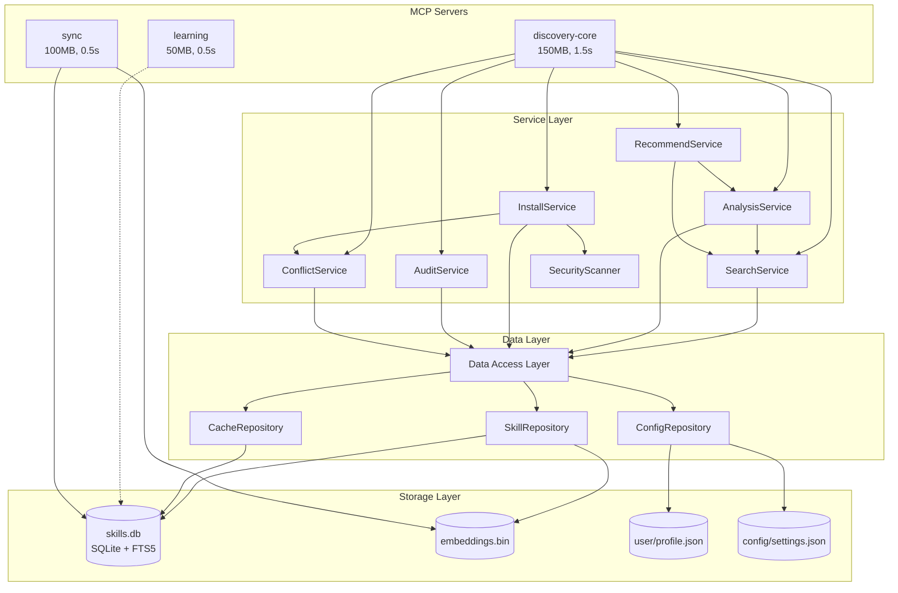

### 2.2 Service Layer Internal Dependencies

```mermaid
graph LR
    subgraph Core[Core Services]
        Search[SearchService]
        Analysis[AnalysisService]
        Recommend[RecommendService]
    end

    subgraph Install[Installation Services]
        Install[InstallService]
        Conflict[ConflictService]
        Security[SecurityScanner]
        Audit[AuditService]
    end

    subgraph Support[Support Services]
        Cache[CacheManager]
        Embed[EmbeddingStore]
        Budget[BudgetCalculator]
        Hook[HookGenerator]
    end

    Search --> Cache
    Search --> Embed
    Analysis --> Search
    Recommend --> Analysis
    Recommend --> Search

    Install --> Conflict
    Install --> Security
    Install --> Budget
    Audit --> Budget
    Audit --> Hook

    Conflict --> Search
    Security --> Cache
```

### 2.3 Data Layer Dependencies

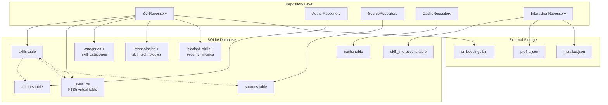

---

## 3. Epic Dependency Matrix

### 3.1 Phase 0 Epics

| Epic ID | Epic Name | Domain | Depends On | Blocks | Phase |
|---------|-----------|--------|------------|--------|-------|
| **DA-001** | Database Foundation | Data | - | DA-002, DA-003, TA-001, TA-002 | 0 |
| **DA-002** | Caching Layer | Data | DA-001 | DA-003, TA-002 | 0 |
| **TA-001** | MCP Server Foundation | Technical | DA-001 | TA-002, PROD-001 | 0 |
| **TA-002** | Search Service POC | Technical | DA-001, DA-002, TA-001 | PROD-001, PROD-002 | 0 |
| **PROD-001** | Basic Skill Search | Product | TA-002 | PROD-002, PROD-003 | 0 |
| **PROD-002** | Skill Detail View | Product | PROD-001 | PROD-003 | 0 |
| **PROD-003** | Install Command Generation | Product | PROD-002 | M0.5 | 0 |
| **PROD-004** | Basic Quality Score | Product | PROD-001 | PROD-104 | 0 |
| **PROD-005** | Curated Skill Index | Product | DA-001 | PROD-101 | 0 |
| **PROD-006** | MCP Server Foundation | Product | TA-001 | PROD-007, PROD-008, PROD-110 | 0 |
| **PROD-007** | Opt-Out Telemetry | Product | PROD-006 | SEC-001 | 0 |
| **SEC-001** | Opt-Out Telemetry Infrastructure | Security | - | SEC-002, SEC-004 | 0 |
| **SEC-002** | Privacy Notice Display | Security | SEC-001 | - | 0 |
| **SEC-003** | Basic Trust Tier Display | Security | - | SEC-107 | 0 |
| **SEC-004** | Codebase Privacy Guarantee | Security | SEC-001, SEC-002 | - | 0 |

### 3.2 Phase 1 Epics

| Epic ID | Epic Name | Domain | Depends On | Blocks | Phase |
|---------|-----------|--------|------------|--------|-------|
| **DA-003** | Sync Infrastructure | Data | DA-001, DA-002 | DA-004, PROD-101 | 1 |
| **DA-004** | Quality Scoring | Data | DA-003 | PROD-104 | 1 |
| **PROD-101** | 50K+ Skill Index | Product | PROD-005, DA-003 | PROD-102, PROD-103, M1.4, M2.1 | 1 |
| **PROD-102** | Search Filtering | Product | PROD-101 | PROD-210 | 1 |
| **PROD-103** | Category Taxonomy | Product | PROD-101 | - | 1 |
| **PROD-104** | Transparent Quality Methodology | Product | PROD-004, DA-004 | PROD-105 | 1 |
| **PROD-105** | Exploration Bonus | Product | PROD-104 | - | 1 |
| **PROD-106** | Trust Tier System | Product | SEC-107 | PROD-203, M2.2 | 1 |
| **PROD-107** | Static Analysis Pipeline | Product | SEC-101, SEC-102, SEC-103 | PROD-108 | 1 |
| **PROD-108** | Blocklist Integration | Product | PROD-107, SEC-106 | - | 1 |
| **PROD-109** | Typosquatting Detection | Product | SEC-105 | - | 1 |
| **PROD-110** | Core CLI Commands | Product | PROD-006 | PROD-111 | 1 |
| **PROD-111** | Offline Mode | Product | PROD-101, PROD-110 | - | 1 |
| **SEC-101** | Jailbreak Pattern Detection | Security | - | SEC-107, PROD-107 | 1 |
| **SEC-102** | URL and Domain Analysis | Security | - | SEC-107, PROD-107 | 1 |
| **SEC-103** | Sensitive File Access Detection | Security | - | SEC-107, PROD-107 | 1 |
| **SEC-104** | Obfuscation Detection | Security | - | SEC-107 | 1 |
| **SEC-105** | Typosquatting Detection Engine | Security | - | PROD-109 | 1 |
| **SEC-106** | Blocklist Infrastructure | Security | - | PROD-108 | 1 |
| **SEC-107** | Trust Tier Computation Engine | Security | SEC-101, SEC-102, SEC-103, SEC-104 | PROD-106 | 1 |

### 3.3 Phase 2 Epics

| Epic ID | Epic Name | Domain | Depends On | Blocks | Phase |
|---------|-----------|--------|------------|--------|-------|
| **DA-005** | Semantic Search with Embeddings | Data | DA-001, DA-003 | PROD-203 | 2 |
| **DA-006** | Telemetry Data Layer | Data | DA-001 | SEC-204 | 2 |
| **PROD-201** | Codebase Scanner | Product | PROD-101 | PROD-202, PROD-208 | 2 |
| **PROD-202** | Technology Detection | Product | PROD-201 | PROD-203 | 2 |
| **PROD-203** | Skill Recommendations | Product | PROD-202, PROD-106, DA-005 | M2.4 | 2 |
| **PROD-204** | Trigger Overlap Detection | Product | SEC-201 | PROD-205 | 2 |
| **PROD-205** | Priority Configuration | Product | PROD-204, SEC-203 | - | 2 |
| **PROD-206** | Static Skill Browser Website | Product | PROD-101 | PROD-207 | 2 |
| **PROD-207** | Skill Comparison | Product | PROD-206 | - | 2 |
| **PROD-208** | VS Code Extension Sidebar | Product | PROD-201 | PROD-209 | 2 |
| **PROD-209** | Context-Aware IDE Suggestions | Product | PROD-208 | - | 2 |
| **PROD-210** | Search Failure States | Product | PROD-102 | - | 2 |
| **PROD-211** | Installation Failure Diagnostics | Product | PROD-003 | - | 2 |
| **PROD-212** | Activation Troubleshooting | Product | PROD-003 | - | 2 |
| **SEC-201** | Trigger Overlap Detection | Security | - | SEC-203, PROD-204 | 2 |
| **SEC-202** | Output Collision Detection | Security | - | SEC-203 | 2 |
| **SEC-203** | Priority Configuration System | Security | SEC-201, SEC-202 | PROD-205 | 2 |
| **SEC-204** | Granular Telemetry Consent | Security | SEC-001, DA-006 | SEC-205 | 2 |
| **SEC-205** | Data Deletion Request | Security | SEC-204 | - | 2 |

### 3.4 Epic Dependency Visualization

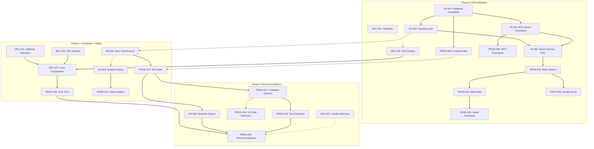

---

## 4. Story Dependencies

### 4.1 Critical Path Stories

These stories form the critical path and must be completed in sequence:

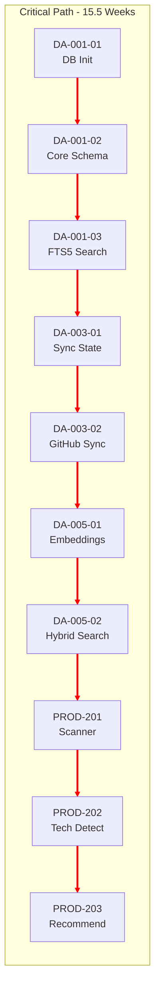

### 4.2 Data Architecture Story Dependencies

| Story ID | Story Name | Depends On | Blocks | Est. |
|----------|------------|------------|--------|------|
| DA-001-01 | Database Initialization | - | DA-001-02, DA-001-03, DA-001-04 | 17h |
| DA-001-02 | Core Schema Implementation | DA-001-01 | DA-001-03 | 16h |
| DA-001-03 | FTS5 Full-Text Search | DA-001-01, DA-001-02 | DA-002-01, TA-002 | 13h |
| DA-001-04 | Repository Pattern | DA-001-01 | DA-002-01, DA-003-01 | 13h |
| DA-002-01 | Cache Table and Operations | DA-001-03, DA-001-04 | DA-003-01 | 11h |
| DA-003-01 | Sync State Machine | DA-001-04, DA-002-01 | DA-003-02, DA-003-03 | 14h |
| DA-003-02 | GitHub Sync Adapter | DA-003-01 | DA-003-03 | 18h |
| DA-003-03 | Deduplication Engine | DA-003-01, DA-003-02 | DA-004-01 | 10h |
| DA-004-01 | Scoring Algorithm | DA-003-03 | PROD-104 | 16h |
| DA-005-01 | Embedding Generation Pipeline | DA-001-01 | DA-005-02 | 20h |
| DA-005-02 | Hybrid Search Implementation | DA-005-01, DA-001-03 | PROD-203 | 8h |
| DA-006-01 | Telemetry Queue | DA-001-01 | SEC-204 | 10h |

### 4.3 Security Story Dependencies

| Story ID | Story Name | Depends On | Blocks | Est. | Priority |
|----------|------------|------------|--------|------|----------|
| SEC-001 | Opt-Out Telemetry | - | SEC-002, SEC-004, SEC-204 | 22h | P0 |
| SEC-002 | Privacy Notice Display | SEC-001 | SEC-004 | 5h | P0 |
| SEC-003 | Basic Trust Tier Display | - | SEC-107 | 5h | P0 |
| SEC-004 | Codebase Privacy Guarantee | SEC-001, SEC-002 | - | 8h | P0 |
| SEC-101 | Jailbreak Pattern Detection | - | SEC-107, PROD-107 | 19h | P0 |
| SEC-102 | URL and Domain Analysis | - | SEC-107, PROD-107 | 13h | P0 |
| SEC-103 | Sensitive File Access Detection | - | SEC-107, PROD-107 | 7h | P0 |
| SEC-104 | Obfuscation Detection | - | SEC-107 | 12h | P1 |
| SEC-105 | Typosquatting Detection Engine | - | PROD-109 | 16h | P0 |
| SEC-106 | Blocklist Infrastructure | - | PROD-108 | 17h | P0 |
| SEC-107 | Trust Tier Computation Engine | SEC-101, SEC-102, SEC-103, SEC-104 | PROD-106 | 15h | P0 |
| SEC-201 | Trigger Overlap Detection | - | SEC-203, PROD-204 | 16h | P0 |
| SEC-202 | Output Collision Detection | - | SEC-203 | 8h | P0 |
| SEC-203 | Priority Configuration System | SEC-201, SEC-202 | PROD-205 | 12h | P1 |
| SEC-204 | Granular Telemetry Consent | SEC-001 | SEC-205 | 13h | P1 |
| SEC-205 | Data Deletion Request | SEC-204 | - | 7h | P2 |

### 4.4 Product Story Dependencies

| Story ID | Story Name | Depends On | Blocks | Est. | Priority |
|----------|------------|------------|--------|------|----------|
| PROD-001 | Basic Skill Search | TA-002 | PROD-002, PROD-004 | 5 SP | P0 |
| PROD-002 | Skill Detail View | PROD-001 | PROD-003 | 3 SP | P0 |
| PROD-003 | Install Command Generation | PROD-002 | PROD-211, PROD-212 | 3 SP | P0 |
| PROD-004 | Basic Quality Score Display | PROD-001 | PROD-104 | 5 SP | P0 |
| PROD-005 | Curated Skill Index | - | PROD-101 | 8 SP | P0 |
| PROD-006 | MCP Server Foundation | TA-001 | PROD-007, PROD-008, PROD-110 | 8 SP | P0 |
| PROD-007 | Opt-Out Telemetry Foundation | PROD-006 | - | 5 SP | P0 |
| PROD-101 | 50K+ Skill Index | PROD-005, DA-003 | PROD-102, PROD-103, PROD-111, PROD-201, PROD-206 | 13 SP | P0 |
| PROD-102 | Search Filtering | PROD-101 | PROD-210 | 5 SP | P0 |
| PROD-106 | Trust Tier System | SEC-107 | PROD-203 | 5 SP | P0 |
| PROD-107 | Static Analysis Pipeline | SEC-101, SEC-102, SEC-103 | PROD-108 | 8 SP | P0 |
| PROD-201 | Codebase Scanner | PROD-101 | PROD-202, PROD-208 | 8 SP | P0 |
| PROD-202 | Technology Detection | PROD-201 | PROD-203 | 8 SP | P0 |
| PROD-203 | Skill Recommendations | PROD-202, PROD-106, DA-005 | - | 8 SP | P0 |
| PROD-206 | Static Skill Browser | PROD-101, PROD-106 | PROD-207, M2.4 | 13 SP | P1 |
| PROD-208 | VS Code Extension | PROD-201, PROD-206 | PROD-209 | 13 SP | P1 |

---

## 5. Cross-Domain Dependencies

### 5.1 Data to Backend Dependencies

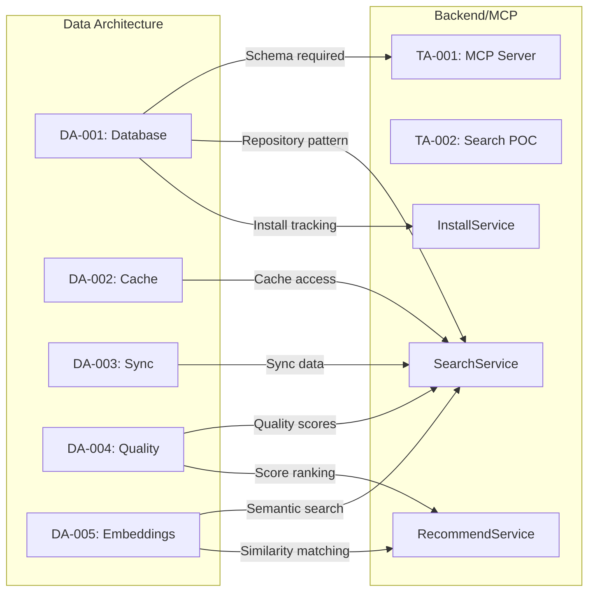

### 5.2 Backend to Frontend Dependencies

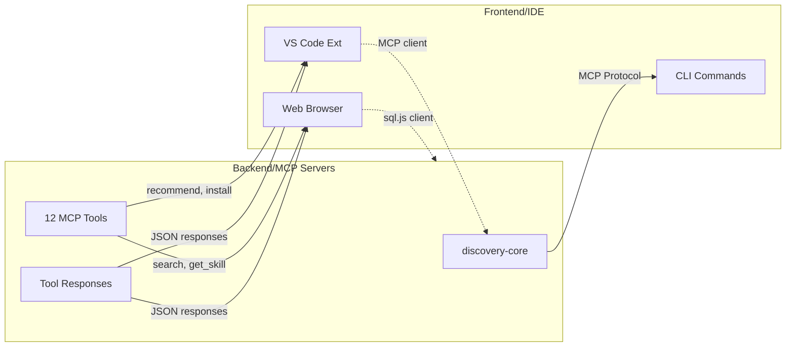

### 5.3 Security to All Domains Dependencies

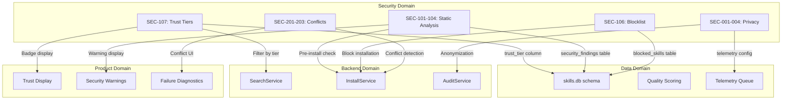

### 5.4 Infrastructure to All Domains Dependencies

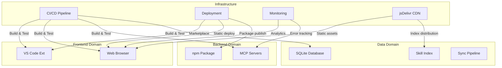

---

## 6. External Dependencies

### 6.1 External Services Matrix

| Service | Used By | Dependency Type | Failure Impact | Fallback |
|---------|---------|-----------------|----------------|----------|
| **GitHub API** | DA-003, sync server | Data source | High - Primary source | Cached data |
| **npm Registry** | DA-003, PROD-005 | Data source | Medium | Cached data |
| **SkillsMP** | DA-003 | Data source | Low | Other sources |
| **claude-plugins.dev** | DA-003 | Data source | Low | Other sources |
| **mcp.so** | DA-003 | Data source | Low | Other sources |
| **jsDelivr CDN** | PROD-101, M1.4 | Distribution | Medium | npm fallback |
| **GitHub Pages** | M1.4 | Hosting | Medium | Local cache |
| **VS Code Marketplace** | M2.4 | Distribution | Medium | Direct install |

### 6.2 External Service Dependency Diagram

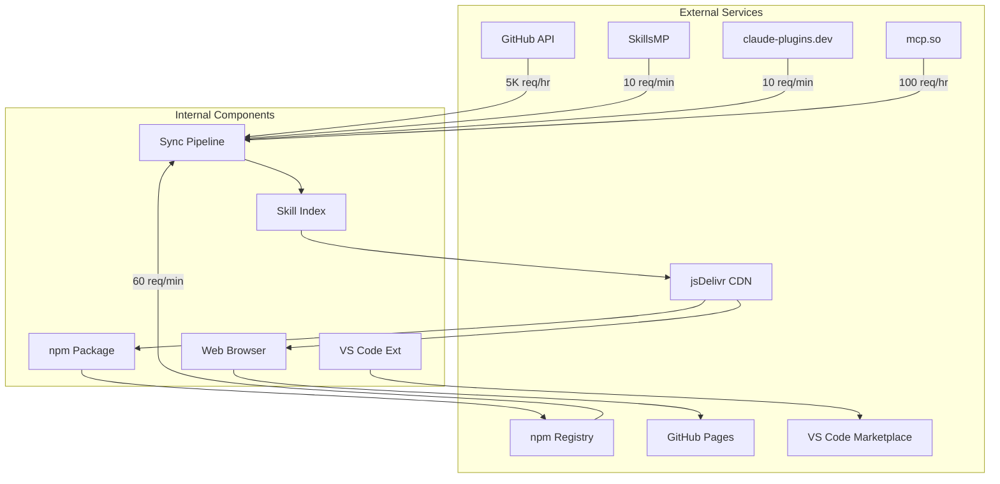

### 6.3 Rate Limit Dependencies

| Source | Rate Limit | Token Rotation | Backoff Strategy |
|--------|-----------|----------------|------------------|
| GitHub REST API | 5,000/hr (authenticated) | Yes (3 tokens) | Exponential |
| GitHub Events API | 300/hr | No | Linear |
| npm Registry | 60/min | No | Linear |
| SkillsMP | ~10/min (estimated) | No | Exponential |
| claude-plugins.dev | ~10/min (estimated) | No | Exponential |
| mcp.so | 100/hr | No | Linear |

---

## 7. Implementation Sequence Diagram

### 7.1 Recommended Implementation Order

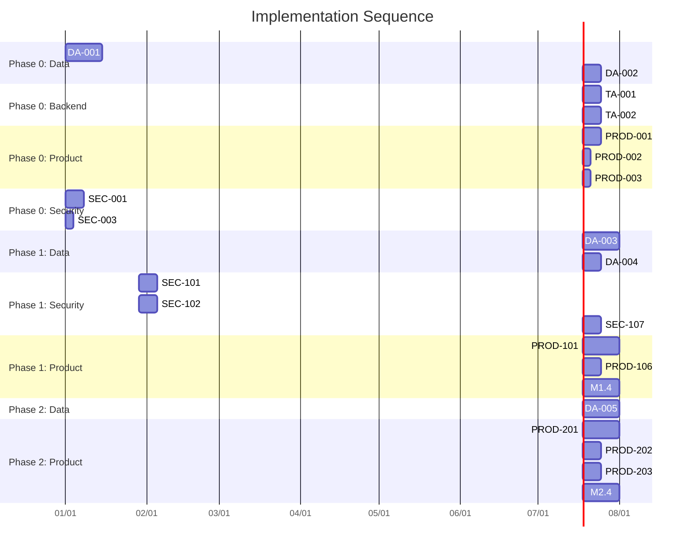

### 7.2 Parallel Work Streams

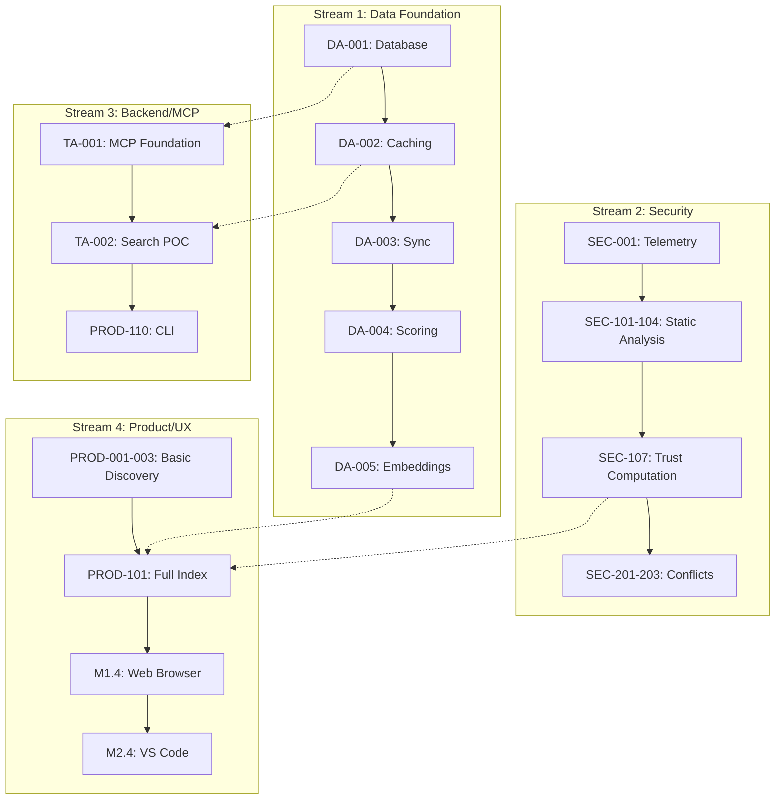

### 7.3 Milestone Dependencies

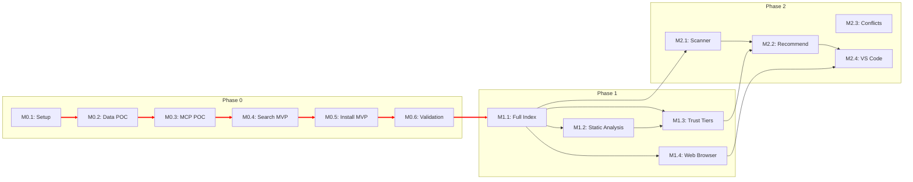

---

## 8. Risk Dependencies

### 8.1 Components Where Delays Cascade

| Component | Downstream Impact | Cascade Severity | Mitigation |
|-----------|------------------|------------------|------------|
| **DA-001: Database Foundation** | Blocks all data operations, MCP servers, search, sync | Critical | Prioritize first, allocate senior dev |
| **DA-003: Sync Infrastructure** | Blocks full index, quality scores, recommendations | High | Start early, parallel source adapters |
| **SEC-107: Trust Computation** | Blocks trust tier display, install warnings | High | Can use mock tiers initially |
| **PROD-101: 50K Index** | Blocks web browser, VS Code, recommendations | High | MVP with 10K first |
| **PROD-201: Codebase Scanner** | Blocks recommendations, VS Code suggestions | Medium | Stub recommendations initially |

### 8.2 Risk Dependency Diagram

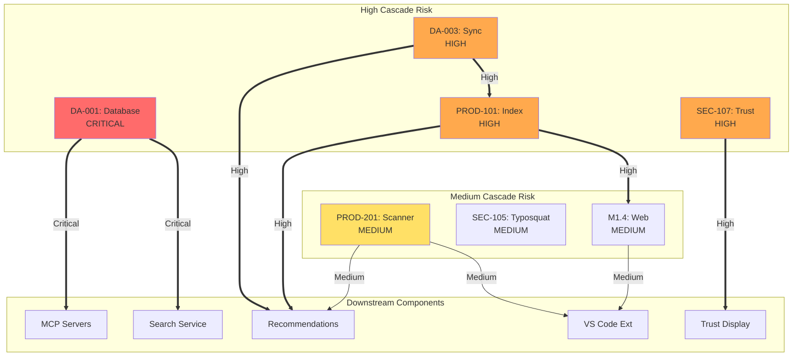

### 8.3 External Service Risk Dependencies

| External Service | Risk Level | Components Affected | Mitigation Strategy |
|-----------------|------------|---------------------|---------------------|
| GitHub API | High | Sync, Index, Quality Scores | Token rotation, caching, Events API |
| GitHub Pages | Medium | Web Browser | Vercel fallback ready |
| npm Registry | Medium | Package distribution | GitHub Releases backup |
| jsDelivr CDN | Low | Index distribution | Multiple CDN fallbacks |
| VS Code Marketplace | Low | Extension distribution | Direct download option |
| Aggregators (3) | Low | Skill coverage | Multiple sources, graceful degradation |

---

## 9. Quick Reference

### 9.1 Phase 0 Critical Dependencies

```
DA-001 --> DA-002 --> TA-002 --> PROD-001 --> PROD-002 --> PROD-003
   |
   +--> TA-001 --> PROD-006 --> PROD-007
   |
   +--> PROD-005

SEC-001 --> SEC-002 --> SEC-004
SEC-003 (independent)
```

### 9.2 Phase 1 Critical Dependencies

```
DA-003 --> DA-004 --> PROD-104
   |
   +--> PROD-101 --> PROD-102, PROD-103, PROD-111

SEC-101 --|
SEC-102 --+--> SEC-107 --> PROD-106
SEC-103 --|

SEC-105 --> PROD-109
SEC-106 --> PROD-108
```

### 9.3 Phase 2 Critical Dependencies

```
DA-005 --> PROD-203
PROD-101 --> PROD-201 --> PROD-202 --> PROD-203
                |
                +--> PROD-208 --> PROD-209

PROD-101 --> PROD-206 --> PROD-207

SEC-201 --|
SEC-202 --+--> SEC-203 --> PROD-205

SEC-204 --> SEC-205
```

### 9.4 Team Assignment by Dependency Chain

| Chain | Primary Owner | Support |
|-------|---------------|---------|
| Data Pipeline: DA-001 to DA-005 | Data Architect | Backend Specialist |
| MCP/Backend: TA-001, TA-002, Services | Backend Specialist | Eng Lead |
| Security: SEC-101 to SEC-205 | Security Specialist | Eng Lead |
| Product Search: PROD-001 to PROD-111 | Backend Specialist | Frontend |
| Product UX: PROD-201 to PROD-212 | Frontend Specialist | PM |
| Web/IDE: M1.4, M2.4 | Frontend Specialist | Backend |

---

## Related Documents

| Document | Purpose |
|----------|---------|
| [System Overview](/docs/architecture/system-overview.md) | Architecture source of truth |
| [Data Architecture](/docs/implementation/02-data-architecture.md) | Data layer epics and stories |
| [Security Implementation](/docs/implementation/06-security.md) | Security epics and stories |
| [Product Requirements](/docs/implementation/08-product-requirements.md) | Product epics and stories |
| [Milestones & Sprints](/docs/implementation/09-milestones-sprints.md) | Sprint structure and milestones |
| [MCP Tool Specs](/docs/implementation/artifacts/mcp-tool-specs.md) | Tool interface definitions |
| [Data Schema](/docs/implementation/artifacts/data-schema.md) | Database schema reference |

---

## Document History

| Version | Date | Author | Changes |
|---------|------|--------|---------|
| 1.0 | December 26, 2025 | Systems Architect | Initial dependency map |

---

*This document should be updated when:*
- *New epics or stories are added*
- *Dependencies change during implementation*
- *External service integrations change*
- *Phase boundaries are adjusted*

*Next Review: After Phase 0 Gate Decision (Week 8)*
